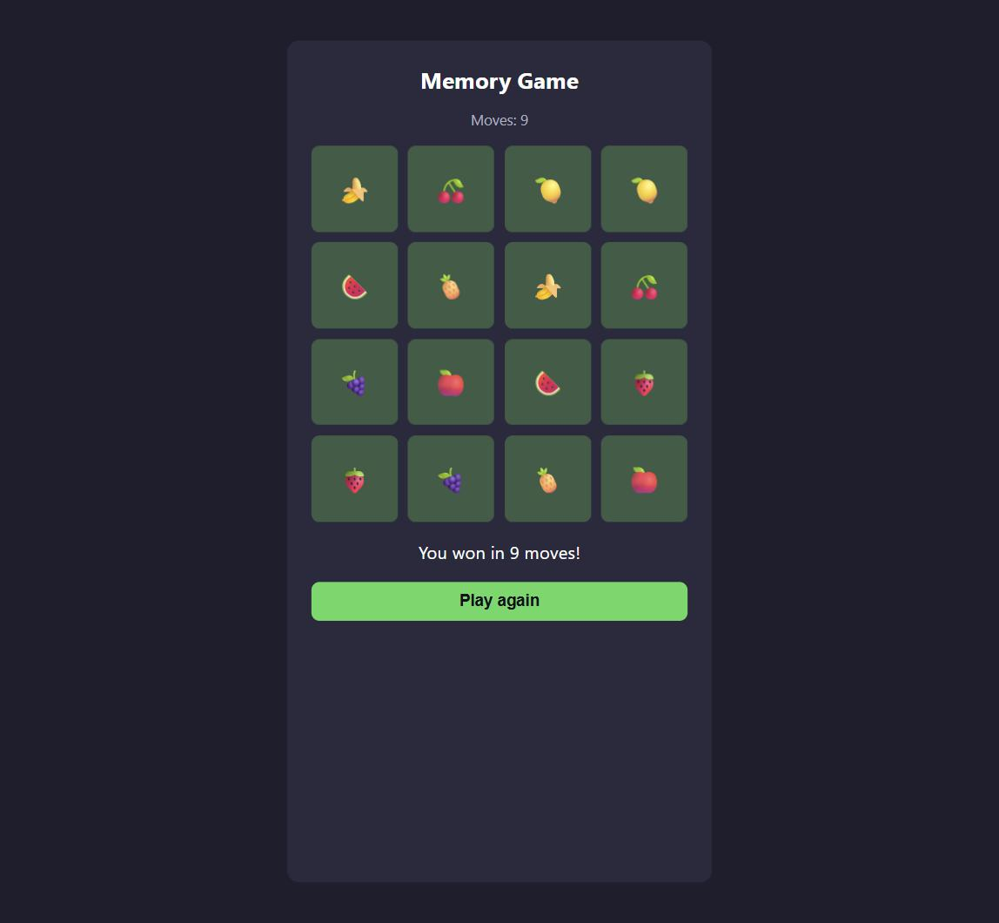

🇬🇧 English | 🇩🇪 [Deutsch](README.de.md)

# JavaScript Course

A beginner-friendly, project-based JavaScript course, written to teach the
fundamentals of software development to colleagues, aspiring trainees
(Azubis), and anyone else who wants to get started. It's built to be handed
over as-is: send someone the link to this repository, and everything they
need to begin is right here. No prior programming experience is assumed on
their part. Every chapter builds on the one before it, and every chapter has
an optional "go further" path for anyone who wants more of a challenge.

This course exists **in German and English side by side**: every chapter is
written as two separate files with the same content, so pick whichever
language you read more comfortably — and switch any time. Code and code
comments, however, are always written in English. That is a deliberate choice
and a real-world convention: professional codebases are written in English
regardless of which language the team speaks, so it is worth getting used to
from the very first line.

A few of the things you'll build along the way, starting from nothing but
programming basics in Course 1:

<table>
<tr>
<td align="center"><br />Course 3 — Calculator GUI</td>
<td align="center"><br />Course 4 — To-Do List</td>
<td align="center"><br />Course 6 — Quiz</td>
<td align="center"><br />Course 7 — Memory Game</td>
</tr>
</table>

## Get this course onto your computer

**Option A — no tools required, if you're just starting out:**

1. Go to <https://github.com/ftrauernicht/javascript-course>.
2. Click the green **Code** button → **Download ZIP**.
3. Extract the downloaded ZIP file anywhere on your computer (right-click it
   → *Extract All* on Windows, or double-click it on Mac).
4. Open the extracted folder. You now have every file this course needs.

**Option B — with [Git](https://git-scm.com/), if you already have it installed:**

```
git clone https://github.com/ftrauernicht/javascript-course.git
```

Either way, nothing here needs installing, building, or a server to run.
Course 1 lives entirely in the browser console (no files at all). Course 2
is the same — typed directly into the console (an optional challenge near
the end has you paste in one reference file). Course 3's calculator runs by
simply double-clicking its `index.html`. The exceptions are
[Course 10](courses/10-rest-api/en/01-rest-api.md) and
[Course 11](courses/11-notes-app/en/01-notes-app.md), which need
[Node.js](https://nodejs.org/) installed — both say so up front. Start
reading at [Course 1 – Basics, Chapter 0](courses/01-basics/en/00-introduction.md).

## What you need before you start

Nothing to install for Course 1 — just a computer and a modern browser.

| Tool | Why you need it | Link |
|---|---|---|
| A browser | To open the developer console, our first "code editor" | [Google Chrome](https://www.google.com/chrome/), [Mozilla Firefox](https://www.mozilla.org/firefox/) |
| A text editor | For Course 3 (the GUI calculator), to write HTML/CSS/JS files | [Visual Studio Code](https://code.visualstudio.com/) |
| [Node.js](https://nodejs.org/) | For Courses 10-11, to run JavaScript outside the browser | [nodejs.org](https://nodejs.org/) |

Step-by-step setup instructions (including how to open the console) are in
[Course 1 – Basics, Chapter 0](courses/01-basics/en/00-introduction.md).

## Courses

This repository is meant to hold more than one course over time. Each one
gets its own number under `courses/`, in the order it was written, so a
future Course 12 lands at `courses/12-.../` alongside these eleven without
disturbing them.

Course 1 is the shared foundation every later course assumes. Courses 2
through 11 are each **independent, standalone** projects that only assume
Course 1 — none of them requires any of the others. Pick whichever sounds
more interesting, in whatever order you like.

### Course 1 – Basics (`courses/01-basics/`)

Not tied to any one project — the shared vocabulary every later course
assumes.

| # | Chapter | What you'll learn |
|---|---|---|
| 0 | [Introduction & Tools](courses/01-basics/en/00-introduction.md) | The browser console, a text editor, how this course is structured |
| 1 | [Programming Basics](courses/01-basics/en/01-programming-basics.md) | Values, variables, operators, the three kinds of brackets, functions, conditionals, loops |

### Course 2 – Calculator Console (`courses/02-calculator-console/`)

Assumes Course 1 only. A calculator built entirely in the browser console —
no files, no interface.

| # | Chapter | What you'll learn |
|---|---|---|
| 1 | [Calculator in the console](courses/02-calculator-console/en/01-calculator-console.md) | Putting Course 1's building blocks into one real program — plus an optional bracket-expression parser |

### Course 3 – Calculator GUI (`courses/03-calculator-gui/`)

Assumes Course 1 only (not Course 2). The same idea, with a real, clickable
interface.

| # | Chapter | What you'll learn |
|---|---|---|
| 1 | [Calculator with a GUI](courses/03-calculator-gui/en/01-calculator-gui.md) | HTML/CSS/JS basics, the DOM, events, and a gentle first step into OOP (classes) |

### Course 4 – To-Do List (`courses/04-todo-list/`)

Assumes Course 1 only. A to-do list with add/check-off/remove and a
data-to-HTML rendering pattern that scales far beyond one calculator button.

| # | Chapter | What you'll learn |
|---|---|---|
| 1 | [To-Do List](courses/04-todo-list/en/01-todo-list.md) | Object literals, arrays of objects, rendering data as HTML, `localStorage` persistence |

### Course 5 – Unit Converter (`courses/05-unit-converter/`)

Assumes Course 1 only. Converts length, weight, and temperature between
units, and hands you noticeably less finished code to copy than earlier
courses — the point here is to build the calculation logic yourself once
you've got the pieces.

| # | Chapter | What you'll learn |
|---|---|---|
| 1 | [Unit Converter](courses/05-unit-converter/en/01-unit-converter.md) | The lookup-table pattern, building elements with `document.createElement`, generalizing a function by turning an assumption into a parameter |

### Course 6 – Quiz (`courses/06-quiz/`)

Assumes Course 1 only. A multiple-choice quiz with scoring, per-answer
feedback, and a result screen — and, like Course 5, gives you noticeably
less finished code than the earliest courses did.

| # | Chapter | What you'll learn |
|---|---|---|
| 1 | [Quiz](courses/06-quiz/en/01-quiz.md) | Classes as templates for objects, modeling a list of questions, re-rendering from data, breaking a feature into small named functions |

### Course 7 – Memory Game (`courses/07-memory-game/`)

Assumes Course 1 only. A card-matching memory game with a shuffled grid,
a CSS-only flip animation, and a delayed flip-back on a mismatch.

| # | Chapter | What you'll learn |
|---|---|---|
| 1 | [Memory Game](courses/07-memory-game/en/01-memory-game.md) | Modeling game state as data, the Fisher-Yates shuffle, `setTimeout`, CSS transitions for a flip effect |

### Course 8 – Weather App (`courses/08-weather-app/`)

Assumes Course 1 only. Looks up real, live weather for any city you type
in — the first course where your code talks to a real, public API.

| # | Chapter | What you'll learn |
|---|---|---|
| 1 | [Weather App](courses/08-weather-app/en/01-weather-app.md) | Promises, `async`/`await`, `fetch`, `try...catch`, calling a real public API |

### Course 9 – Budget Tracker (`courses/09-budget-tracker/`)

Assumes Course 1 only. Tracks income and expenses, with a balance and a
category breakdown drawn as a plain CSS bar chart.

| # | Chapter | What you'll learn |
|---|---|---|
| 1 | [Budget Tracker](courses/09-budget-tracker/en/01-budget-tracker.md) | `.filter(...)`, `.reduce(...)`, `Object.keys(...)`, a CSS-only chart driven entirely by data |

### Course 10 – REST API with Node.js + Express (`courses/10-rest-api/`)

Assumes Course 1 only. Builds a small server with Node.js and Express —
the first course where your JavaScript runs outside a browser entirely.

| # | Chapter | What you'll learn |
|---|---|---|
| 1 | [REST API](courses/10-rest-api/en/01-rest-api.md) | Node.js, npm, Express routing, HTTP methods and status codes, testing an API with `curl` |

### Course 11 – Full-Stack Notes App (`courses/11-notes-app/`)

Assumes Course 1 only. Connects a frontend and a backend for the first
time — a notes app backed by a real SQLite database instead of memory or
`localStorage`.

| # | Chapter | What you'll learn |
|---|---|---|
| 1 | [Notes App](courses/11-notes-app/en/01-notes-app.md) | SQL (`CREATE TABLE`/`SELECT`/`INSERT`/`UPDATE`/`DELETE`), Node's built-in `node:sqlite`, serving a frontend and an API from one Express server (no CORS) |

More courses will be added over time; this section grows with them.

## Project ideas

Once you've finished Courses 2 through 11, [PROJECT-IDEAS.md](PROJECT-IDEAS.md)
has a ranked list of what to build next — from a straightforward next step
to a genuinely ambitious one. It lives at the repository root, not inside a
single course, because any of these ideas could become this repository's
Course 12.

## How to use this course

1. Read a chapter top to bottom.
2. Type the examples yourself instead of copy-pasting them — typing is what
   builds the muscle memory, copy-pasting only builds a scrollbar.
3. Every chapter has a **core section** (🟢, required to move on) and one or
   more **optional sections** (🟡 solid extra practice, 🔴 a genuine
   challenge). Skipping the optional parts is completely fine — come back to
   them later if you like.
4. Within a course, later chapters explicitly reuse code from earlier ones.
   Across courses, nothing is assumed except Course 1 — Courses 2 through 11
   each build whatever logic they need from scratch, on purpose, so any of
   them can be done first.
5. Links inside each chapter point to the relevant [MDN Web Docs](https://developer.mozilla.org/)
   page (the standard JavaScript reference) right where a new concept shows
   up, instead of collecting them in a glossary at the end. If a term is
   unclear, the nearest link is your glossary.

## Repository layout

```
PROJECT-IDEAS.md / .de.md   ideas for what a future course could be
courses/
  01-basics/                 Course 1 — general, not tied to one project
    en/                        chapter text, English
    de/                        chapter text, German (Kapiteltexte, Deutsch)
  02-calculator-console/     Course 2 — calculator, in the console
    en/                        chapter text, English
    de/                        chapter text, German
    code/                      reference solutions (calculate.js, bracket-parser.js)
  03-calculator-gui/         Course 3 — calculator, with a GUI
    en/                        chapter text, English
    de/                        chapter text, German
    code/                      the working GUI calculator (index.html, style.css, script.js)
    assets/                    screenshots used in the chapter
  04-todo-list/              Course 4 — to-do list
    en/                        chapter text, English
    de/                        chapter text, German
    code/                      the working to-do list (index.html, style.css, script.js)
    assets/                    screenshots used in the chapter
  05-unit-converter/         Course 5 — unit converter
    en/                        chapter text, English
    de/                        chapter text, German
    code/                      the working unit converter (index.html, style.css, script.js)
    assets/                    screenshots used in the chapter
  06-quiz/                   Course 6 — multiple-choice quiz
    en/                        chapter text, English
    de/                        chapter text, German
    code/                      the working quiz (index.html, style.css, script.js)
    assets/                    screenshots used in the chapter
  07-memory-game/            Course 7 — memory / matching game
    en/                        chapter text, English
    de/                        chapter text, German
    code/                      the working memory game (index.html, style.css, script.js)
    assets/                    screenshots used in the chapter
  08-weather-app/            Course 8 — weather app (fetch, async/await)
    en/                        chapter text, English
    de/                        chapter text, German
    code/                      the working weather app (index.html, style.css, script.js)
    assets/                    screenshots used in the chapter
  09-budget-tracker/         Course 9 — budget tracker
    en/                        chapter text, English
    de/                        chapter text, German
    code/                      the working budget tracker (index.html, style.css, script.js)
    assets/                    screenshots used in the chapter
  10-rest-api/               Course 10 — REST API with Node.js + Express
    en/                        chapter text, English
    de/                        chapter text, German
    code/                      the working server (package.json, server.js) — no assets/, no GUI
  11-notes-app/              Course 11 — full-stack notes app (Express + SQLite)
    en/                        chapter text, English
    de/                        chapter text, German
    code/                      the working app (package.json, db.js, server.js, public/)
    assets/                    screenshots used in the chapter
  12-.../                    future courses, same pattern
```

## Contributing

See [CONTRIBUTING.md](CONTRIBUTING.md).
