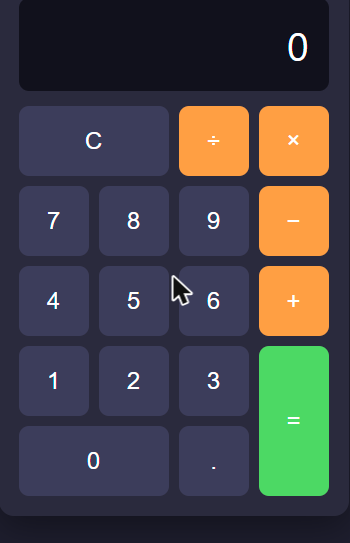

🇬🇧 English | 🇩🇪 [Deutsch](../de/01-taschenrechner-gui.md)

[← Back to course overview](../../../README.md) · Related: [Course 2 – Calculator Console](../../02-calculator-console/en/01-calculator-console.md) (not required — see "Next" below)

# Chapter 1 – Calculator with a GUI

**Goal:** build a calculator with a real, clickable interface on a web
page — buttons, a display, the works. This course assumes
[Course 1 – Basics](../../01-basics/en/00-introduction.md) (variables,
functions, conditionals) and nothing else; it stands entirely on its own.

The finished reference files for this chapter live in
[`courses/03-calculator-gui/code/`](../code/): `index.html`, `style.css`,
`script.js`. `index.html` and `style.css` are ready to use as they are — the
structure and styling aren't the point of this chapter. `script.js` is the
actual exercise, though: copy all three files into your own working folder,
empty out your copy of `script.js`, and build it back up as the chapter
goes — the `script.js` in `code/` is the finished answer, there for you to
compare against or peek at whenever the text points you to it. Open your
`index.html` (double-click it, or open it from your file manager) any time
you want to see the current state — it's just a local file, no server
required.

Here's the finished result you're working towards:



## 🟢 Core — The three building blocks of a web page

A web page is built from three languages, each with one job:

- **HTML** — the structure: what elements exist (a button, a heading, a
  text box) and how they're nested. [MDN – HTML basics](https://developer.mozilla.org/en-US/docs/Learn_web_development/Core/Structuring_content).
- **CSS** — the appearance: colors, spacing, layout.
  [MDN – CSS basics](https://developer.mozilla.org/en-US/docs/Learn_web_development/Core/Styling_basics).
- **JavaScript** — the behavior: what happens when you click, type, or
  wait. This is the layer this chapter focuses on.

A minimal HTML file looks like this:

```html
<!DOCTYPE html>
<html lang="en">
<head>
  <meta charset="UTF-8" />
  <title>Calculator</title>
  <link rel="stylesheet" href="style.css" />
</head>
<body>
  <!-- content goes here -->
  <script src="script.js"></script>
</body>
</html>
```

`<link rel="stylesheet" ...>` pulls in the CSS file; `<script src="...">` at
the bottom of `<body>` pulls in the JavaScript file *after* the page's
elements exist, which matters — JavaScript that runs before an element
exists can't find it yet.

## 🟢 Core — Building the layout (HTML + CSS)

The calculator is a display plus a grid of buttons. Have a look at the full
version in [`index.html`](../code/index.html) — the important part is that
every button carries a small custom attribute describing what it does:

```html
<div id="display" class="display">0</div>

<button data-digit="7">7</button>
<button data-operator="+">+</button>
<button data-action="equals">=</button>
<button data-action="clear">C</button>
```

`data-digit`, `data-operator`, and `data-action` are
[custom data attributes](https://developer.mozilla.org/en-US/docs/Web/HTML/How_to/Use_data_attributes) —
a standard, JavaScript-friendly way to attach a bit of information to an
HTML element without inventing your own tag. You'll read these back out in
JavaScript in a moment.

The look of the calculator (the dark background, the grid, the orange
operator buttons) is handled entirely in
[`style.css`](../code/style.css) using
[CSS Grid](https://developer.mozilla.org/en-US/docs/Web/CSS/CSS_grid_layout) —
skim it, but don't worry about mastering CSS Grid right now; that's a topic
for its own chapter later.

## 🟢 Core — A small calculation engine

Before wiring up any buttons, write the actual math as one small, plain
function — independent of any button or screen:

```js
function calculate(a, operator, b) {
  if (operator === "+") {
    return a + b;
  } else if (operator === "-") {
    return a - b;
  } else if (operator === "*") {
    return a * b;
  } else if (operator === "/") {
    if (b === 0) {
      console.warn("Cannot divide by zero.");
      return NaN;
    }
    return a / b;
  } else {
    console.warn("Unknown operator: " + operator);
    return NaN;
  }
}

calculate(3, "+", 4); // 7
```

Both error cases return
[`NaN`](https://developer.mozilla.org/en-US/docs/Web/JavaScript/Reference/Global_Objects/NaN)
("Not a Number") instead of crashing — that lets whatever called `calculate`
notice something went wrong and react, instead of the whole page breaking.

Paste this into the browser console (see
[Course 1 – Basics](../../01-basics/en/00-introduction.md) for how to open
it) and try a few calculations before connecting it to anything. Notice
it's a **pure function**: the same three inputs always produce the same
result, and it never touches the page at all — which is exactly why it's
easy to test on its own like this, and exactly what makes it easy to wire
up to buttons next. (If you've already built this exact function in
[Course 2 – Calculator Console](../../02-calculator-console/en/01-calculator-console.md),
it's the same idea — feel free to skim this section.)

## 🟢 Core — Making buttons do something (the DOM + events)

So far everything has lived in the console. From here on, everything you
write goes into `script.js` — that's the file `index.html` actually loads,
so anything you want to keep working has to live there, not in a one-off
console line.

JavaScript doesn't see your HTML tags directly — it sees the **DOM**
(Document Object Model), the browser's live, in-memory representation of the
page. You find elements in it, then attach behavior to them. Add this to
`script.js`, after the `calculate` function from above:

```js
const display = document.getElementById("display");
```

[`document.getElementById`](https://developer.mozilla.org/en-US/docs/Web/API/Document/getElementById)
finds one element by its `id` — here, the `<div id="display">` from the
layout section.

Before wiring up the real buttons, it's worth seeing the click-handling
pattern once on its own. This next bit is a **throwaway experiment, not
something to add to `script.js`**: open `index.html` in your browser, open
*that page's* developer console (same as [Course 1 – Basics](../../01-basics/en/00-introduction.md),
just on this page instead of a blank tab — this needs an actual loaded page
to find `display` and the buttons on, which is why it won't work in a plain
Node console the way `calculate` did), and paste this in directly:

```js
const equalsButton = document.querySelector('[data-action="equals"]');
equalsButton.addEventListener("click", () => {
  console.log("Equals was clicked!");
});
```

Click the `=` button and watch the console. Then:

- [`document.querySelector` / `querySelectorAll`](https://developer.mozilla.org/en-US/docs/Web/API/Document/querySelectorAll) finds elements using a CSS-style selector — here, "any element with a `data-action` attribute equal to `"equals"`".
- [`addEventListener("click", ...)`](https://developer.mozilla.org/en-US/docs/Web/API/EventTarget/addEventListener) says "run this function whenever this element is clicked." The function you pass in (`() => { ... }`) is an [arrow function](https://developer.mozilla.org/en-US/docs/Web/JavaScript/Reference/Functions/Arrow_functions) — a shorter way to write a small function, especially one you're only using once, right here.

Now, back in `script.js` for real: wire up the digit buttons using a few
plain variables to track state:

```js
let currentValue = "0";
let previousValue = null;
let operator = null;

function updateDisplay() {
  display.textContent = currentValue;
}

document.querySelectorAll("[data-digit]").forEach((button) => {
  button.addEventListener("click", () => {
    currentValue = currentValue === "0" ? button.dataset.digit : currentValue + button.dataset.digit;
    updateDisplay();
  });
});
```

- `button.dataset.digit` is how JavaScript reads a `data-digit="..."`
  attribute back out.
- [`.forEach(...)`](https://developer.mozilla.org/en-US/docs/Web/JavaScript/Reference/Global_Objects/Array/forEach)
  runs a function once for every item in a list — here, once per digit
  button, so this one `addEventListener` call wires up all ten digits
  instead of repeating it ten times. `querySelectorAll` returns exactly that
  kind of list.

Save `script.js` and reload `index.html`: the digit buttons work now — click
`7` then `3` and the display shows `73`. The operator, equals, and clear
buttons are deliberately left unwired for the moment. Doing them properly
with loose variables like these starts getting tangled fast (remembering
whether you're "waiting for the second number," handling `3 + 4 × 2` as a
chain instead of just one operation, and so on) — which is exactly the
problem the next section solves.

## 🟢 Core — From loose variables to a class: a gentle first step into OOP

Look at what just happened: `currentValue`, `previousValue`, `operator`, and
several functions all belong together — none of them makes sense on its own,
they only make sense as *the state and behavior of one calculator*. When
data and the functions that work on it belong together like that, JavaScript
gives you a way to bundle them into a single thing: a **class**.

Think of a class as a blueprint (a cookie cutter); an **object** created
from it (`new Calculator(...)`) is one actual cookie made from that blueprint
— you could make several independent calculators from the same class if you
wanted to.

```js
class Calculator {
  constructor(displayElement) {
    this.displayElement = displayElement;
    this.currentValue = "0";
    this.previousValue = null;
    this.operator = null;
  }

  inputDigit(digit) {
    this.currentValue =
      this.currentValue === "0" ? digit : this.currentValue + digit;
    this.updateDisplay();
  }

  updateDisplay() {
    this.displayElement.textContent = this.currentValue;
  }
}

const calculator = new Calculator(display);
```

A few names for what you're looking at:

- The `constructor` runs once, when you create the object with `new`. It
  sets up the object's starting values.
- `this` refers to "the specific object this method was called on" — inside
  `Calculator`, `this.currentValue` is that object's own value, so two
  different `Calculator` objects each keep their own, independent
  `currentValue`.
- `inputDigit` and `updateDisplay` are **methods** — functions that live
  inside the class and act on `this`.

Reference: [MDN – Classes](https://developer.mozilla.org/en-US/docs/Web/JavaScript/Reference/Classes).
This is intentionally the small, useful slice of OOP — no inheritance, no
static members, no private fields. Those exist and are worth learning
eventually, but they'd be extra weight you don't need for a calculator.

Replace `script.js`'s digit-wiring `document.querySelectorAll(...)` block
with this class version (`button.dataset.digit` gets passed straight to
`calculator.inputDigit(...)` now instead of a loose `currentValue`
variable). The full class in [`script.js`](../code/script.js) rounds this
out with three more pieces, worth knowing about before you read it:

- `inputDigit` itself grows a little more logic than shown above: a guard so
  typing `.` twice doesn't add a second decimal point, and a flag
  (`shouldResetDisplay`) that clears the display right after you press an
  operator — without it, pressing `3`, `+`, `4` would show `34` instead of
  replacing the `3` with `4`.
- `chooseOperator` also handles chaining: if you press an operator while one
  is already pending, it quietly runs `equals()` first, which is what makes
  `3 + 4 × 2` correctly show `14` instead of getting confused.
- `equals()` is where `calculate` (from the "calculation engine" section
  above) finally gets called: `calculate(Number(this.previousValue), this.operator, Number(this.currentValue))`.

None of this changes the *shape* you just learned — it's still a
`constructor` plus methods acting on `this`, just with a few real-world
edge cases handled. Once your `script.js` matches it, reload `index.html`
and open its console again: try `calculator.inputDigit("7")` then
`calculator.inputDigit("3")` directly there, and you'll see `"73"` appear on
the actual calculator — a quick way to poke at the class from outside,
though normally you'd just click the buttons.

## 🟡 Optional — Keyboard support

Right now the calculator only responds to clicks. Add a listener for
keyboard input so typing works too:

```js
document.addEventListener("keydown", (event) => {
  if (event.key >= "0" && event.key <= "9") {
    calculator.inputDigit(event.key);
  } else if (["+", "-", "*", "/"].includes(event.key)) {
    calculator.chooseOperator(event.key);
  } else if (event.key === "Enter") {
    calculator.equals();
  } else if (event.key === "Escape") {
    calculator.clear();
  }
});
```

`["+", "-", "*", "/"].includes(event.key)` checks whether `event.key` is any
one of those four strings — shorter than four separate `||` comparisons.
Reference: [MDN – KeyboardEvent](https://developer.mozilla.org/en-US/docs/Web/API/KeyboardEvent),
[MDN – Array.includes](https://developer.mozilla.org/en-US/docs/Web/JavaScript/Reference/Global_Objects/Array/includes).

## 🟡 Optional — A calculation history

Keep an array of past calculations and render them as a list — good practice
with [arrays](https://developer.mozilla.org/en-US/docs/Web/JavaScript/Guide/Indexed_collections)
and turning data into HTML.

Add somewhere in `index.html` (below the calculator, say) an empty list to
render into:

```html
<ul id="history"></ul>
```

Then in `script.js`:

```js
const historyElement = document.getElementById("history");
const history = [];

function recordHistory(a, operator, b, result) {
  history.push(a + " " + operator + " " + b + " = " + result);
  historyElement.innerHTML = history
    .map((entry) => "<li>" + entry + "</li>")
    .join("");
}
```

- [`.push(...)`](https://developer.mozilla.org/en-US/docs/Web/JavaScript/Reference/Global_Objects/Array/push) adds an item to the end of an array.
- [`.map(...)`](https://developer.mozilla.org/en-US/docs/Web/JavaScript/Reference/Global_Objects/Array/map) builds a *new* array by running a function on every item of an existing one — here, turning each history entry into an `<li>...</li>` string — and `.join("")` glues that array of strings into one, ready to drop into `innerHTML`.

Call `recordHistory(...)` with the same four values right before `equals()`
updates `this.currentValue`.

## 🔴 Optional, genuine challenge — Parentheses in the GUI

Add `(` and `)` buttons, and instead of calculating step-by-step with two
numbers at a time, build up the *entire* expression as a string (e.g.
`"(3+4)*2"`) and evaluate it all at once when equals is pressed, respecting
parentheses and normal operator precedence. That means writing your own
small parser — a tokenizer plus a function that respects parentheses and
precedence, exactly the kind of problem
[Course 2 – Calculator Console](../../02-calculator-console/en/01-calculator-console.md)'s
optional bracket-parser challenge tackles, if you'd like a reference
solution to compare against; otherwise, it's a satisfying thing to build
from scratch.

## Try it yourself

Click `3`, `+`, `4`, `×`, `2`, `=` and you should see this:


Notice that this shows `14`, computed step by step (3 + 4 = 7, then
7 × 2 = 14) — left to right, the way simple calculators work, *not* the
mathematically "correct" order of operations (which would give `11`). Only
a from-scratch parser (see the optional challenge above) respects full
precedence; this basic GUI calculator deliberately doesn't, same as most
physical pocket calculators.

Open [`courses/03-calculator-gui/code/index.html`](../code/index.html) in
your browser — double-clicking the file works fine, since everything is
local with no external requests. If you'd rather edit-and-refresh
comfortably, VS Code's
[Live Server extension](https://marketplace.visualstudio.com/items?itemName=ritwickdey.LiveServer)
reloads the page automatically whenever you save.

## Checkpoint & what you learned

- HTML structure, CSS for layout/appearance, JavaScript for behavior
- The DOM: finding elements, reading `data-*` attributes
- Events: `addEventListener`
- A small, pure calculation function, wired up to a real interface
- Classes: `constructor`, `this`, methods — a first, deliberately small step into OOP
- *(optional)* Writing your own bracket-respecting parser

## What's next

This course stands on its own — you've built a complete calculator with a
real interface. If you haven't already,
[Course 2 – Calculator Console](../../02-calculator-console/en/01-calculator-console.md)
solves the same kind of problem without a graphical interface — worth a
look if you'd like to compare the two approaches, but not required. For a
broader menu of what to build next, see
[PROJECT-IDEAS.md](../../../PROJECT-IDEAS.md).
