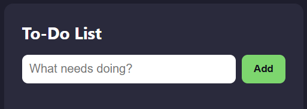
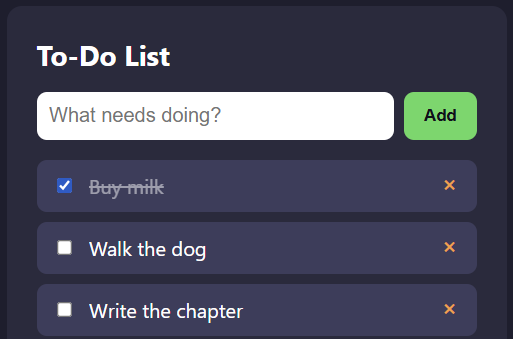

🇩🇪 Deutsch | 🇬🇧 [English](../en/01-todo-list.md)

[← Zurück zur Kursübersicht](../../../README.de.md) · Verwandt: [Kurs 3 – Taschenrechner GUI](../../03-calculator-gui/de/01-taschenrechner-gui.md) (nicht vorausgesetzt: Falls du ihn gemacht hast, kommen dir die DOM-Teile unten bekannt vor)

# Kapitel 1 – To-Do-Liste

**Ziel:** eine To-Do-Liste bauen, der du Aufgaben hinzufügen, abhaken und
entfernen kannst. Sie soll sich außerdem beim nächsten Öffnen der Seite an
deine Liste erinnern. Dieser Kurs setzt ausschließlich
[Kurs 1 – Basics](../../01-basics/de/00-einleitung.md) voraus (Werte,
Variablen, Operatoren, Klammern, Funktionen, Bedingungen, Schleifen) und
sonst nichts; er steht vollständig für sich.

Die fertigen Referenzdateien liegen in
[`courses/04-todo-list/code/`](../code/): `index.html`, `style.css`,
`script.js`. `index.html` und `style.css` kannst du unverändert übernehmen.
`script.js` ist die eigentliche Übung: Kopier dir alle drei Dateien in
einen eigenen Arbeitsordner, leer deine Kopie von `script.js`, und bau sie
Stück für Stück wieder auf, während du das Kapitel durcharbeitest. Die
`script.js` in `code/` ist die fertige Lösung zum Vergleichen.

So sieht das fertige Ergebnis aus, auf das du hinarbeitest:



## 🟢 Kern — Das Layout (HTML + CSS)

Die ganze App ist ein Eingabefeld, ein "Add"-Button und eine leere Liste,
die später gefüllt wird:

```html
<div class="app">
  <h1>To-Do List</h1>

  <div class="add-row">
    <input type="text" id="task-input" placeholder="What needs doing?" autocomplete="off" />
    <button id="add-button">Add</button>
  </div>

  <ul id="task-list"></ul>
</div>
```

`<ul id="task-list"></ul>` startet absichtlich leer. JavaScript füllt sie
anhand deiner Daten, genau darum geht es in diesem Kapitel. Die
vollständige Version steht in [`index.html`](../code/index.html) und
[`style.css`](../code/style.css); das Styling ist hier nicht der Fokus,
überflieg es also ruhig.

## 🟢 Kern — Aufgaben als Daten darstellen

Bevor überhaupt die Seite angefasst wird: Entscheide, was eine "Aufgabe" im
Code eigentlich *ist*. Jede braucht zwei Informationen: ihren Text, und ob
sie erledigt ist. Das ist ein Fall für ein **Objektliteral**, eine andere
Verwendung von `{}` als die aus
[Kurs 1](../../01-basics/de/01-programmier-grundlagen.md): Dort umschloss
`{}` einen *Block* aus Anweisungen; hier umschließt `{}`
`schlüssel: wert`-Paare und ergibt einen *Wert*, den du wie ein Array in
einer Variable speichern kannst:

```js
const task = { text: "Buy milk", done: false };
task.text; // "Buy milk"
task.done; // false
```

Die ganze Liste ist ein Array aus solchen:

```js
let tasks = [
  { text: "Buy milk", done: false },
  { text: "Walk the dog", done: true },
];
```

Mehr: [MDN – Mit Objekten arbeiten](https://developer.mozilla.org/de/docs/Web/JavaScript/Guide/Working_with_objects).

Ab jetzt kommt alles in `script.js`, der Datei, die `index.html`
tatsächlich lädt. Starte mit:

```js
const input = document.getElementById("task-input");
const addButton = document.getElementById("add-button");
const list = document.getElementById("task-list");

let tasks = [];
```

## 🟢 Kern — Das DOM, kurz gefasst

*(Falls du [Kurs 3 – Taschenrechner GUI](../../03-calculator-gui/de/01-taschenrechner-gui.md) gemacht hast, ist dir das alles schon bekannt. Spring direkt zum nächsten Abschnitt.)*

JavaScript sieht deine HTML-Tags nicht direkt. Es sieht das **DOM**
(Document Object Model), die lebendige Repräsentation der Seite im
Speicher, die der Browser erzeugt. Eine Handvoll Werkzeuge lässt dich
Elemente finden und ihnen Verhalten anhängen, und dieses ganze Kapitel
braucht nur vier davon:

- [`document.getElementById(...)`](https://developer.mozilla.org/de/docs/Web/API/Document/getElementById)
  findet ein einzelnes Element über seine `id`. Genau das haben die drei
  Zeilen oben gerade getan: Eingabefeld, Button und Listen-Container in
  Variablen abgelegt.
- [`document.querySelectorAll(...)`](https://developer.mozilla.org/de/docs/Web/API/Document/querySelectorAll)
  findet *jedes* passende Element zu einem CSS-artigen Selektor, als Liste,
  über die du iterieren kannst. Unten kommt das zum Einsatz, um auf einen
  Schlag jede Checkbox oder jeden Entfernen-Button zu finden, egal wie
  viele Aufgaben es gerade gibt.
- [`.forEach(...)`](https://developer.mozilla.org/de/docs/Web/JavaScript/Reference/Global_Objects/Array/forEach)
  führt eine Funktion einmal für jedes Element einer Liste aus. Das passt
  natürlich zur Liste von Elementen aus `querySelectorAll`: ein Aufruf pro
  Element, statt für jeden Button von Hand eine Zeile zu schreiben.
- [`addEventListener("click", ...)`](https://developer.mozilla.org/de/docs/Web/API/EventTarget/addEventListener)
  (oder `"change"`, weiter unten) bedeutet "führe diese Funktion aus,
  sobald dieses Event an diesem Element passiert." Die übergebene Funktion
  (`() => { ... }`) ist eine
  [Arrow Function](https://developer.mozilla.org/de/docs/Web/JavaScript/Reference/Functions/Arrow_functions),
  eine kürzere Schreibweise für eine kleine Funktion, besonders wenn du sie
  nur einmal, genau hier, brauchst.

## 🟢 Kern — Die Liste aus Daten rendern

Das ist der Kerntrick des ganzen Kapitels: Statt für jede Aufgabe von Hand
HTML zu schreiben, schreibst du eine Funktion, die *das, was gerade in
`tasks` steht*, in HTML verwandelt, und rufst sie jedes Mal auf, wenn sich
die Daten ändern.

```js
function render() {
  list.innerHTML = tasks
    .map((task, index) => {
      const doneClass = task.done ? "task done" : "task";
      const checkedAttribute = task.done ? "checked" : "";
      return `
        <li class="${doneClass}">
          <input type="checkbox" data-index="${index}" ${checkedAttribute} />
          <span>${task.text}</span>
          <button class="remove" data-index="${index}">&times;</button>
        </li>
      `;
    })
    .join("");
}
```

Ein paar neue Teile:

- `` `...${doneClass}...` `` ist ein
  [Template Literal](https://developer.mozilla.org/de/docs/Web/JavaScript/Reference/Template_literals):
  Backticks statt Anführungszeichen erlauben es, eine Variable direkt mit
  `${...}` in einen String einzusetzen, deutlich lesbarer als Teile mit `+`
  zusammenzukleben.
- [`.map(...)`](https://developer.mozilla.org/de/docs/Web/JavaScript/Reference/Global_Objects/Array/map)
  baut ein *neues* Array, indem eine Funktion auf jedes Element eines
  bestehenden angewendet wird. Hier wird jedes Task-Objekt in einen
  HTML-String verwandelt. Das zweite Argument der übergebenen Funktion,
  `index`, ist die Position des Elements (0, 1, 2, …). Du brauchst sie
  gleich, um Aufgaben auseinanderzuhalten.
- `.join("")` klebt dieses Array aus Strings zu einem einzigen zusammen,
  bereit für `innerHTML`.
- `data-index="${index}"` speichert die Position jeder Aufgabe direkt in
  ihrem HTML, dieselbe Idee der
  [eigenen Data-Attribute](https://developer.mozilla.org/de/docs/Web/HTML/How_to/Use_data_attributes)
  aus Kurs 3. So wissen die Klick-Handler unten gleich, zu *welcher*
  Aufgabe sie gehören.

Ruf `render()` einmal ganz am Ende von `script.js` auf (nach allem anderen
aus diesem Kapitel), damit die Seite beim Laden sofort etwas zeigt, auch
wenn `tasks` zunächst leer ist.

## 🟢 Kern — Eine Aufgabe hinzufügen

```js
function addTask() {
  const text = input.value.trim();
  if (text === "") {
    return;
  }

  tasks.push({ text: text, done: false });
  input.value = "";
  render();
}

addButton.addEventListener("click", addTask);
```

- `input.value` liest, was gerade im Textfeld steht.
- [`.trim()`](https://developer.mozilla.org/de/docs/Web/JavaScript/Reference/Global_Objects/String/trim)
  entfernt führende/nachfolgende Leerzeichen. So schleicht sich eine
  Aufgabe aus nur Leerzeichen nicht als "leer, aber eigentlich doch nicht"
  durch.
- [`.push(...)`](https://developer.mozilla.org/de/docs/Web/JavaScript/Reference/Global_Objects/Array/push)
  fügt dem `tasks`-Array ein neues Element am Ende hinzu.
- `input.value = ""` leert das Feld nach dem Hinzufügen, bereit für die
  nächste Aufgabe.

Speichern, `index.html` neu laden, etwas eintippen und **Add** klicken:
Die neue Aufgabe erscheint (lässt sich aber noch nicht abhaken oder
entfernen; das kommt als Nächstes).

## 🟢 Kern — Eine Aufgabe abhaken und entfernen

Jedes Mal, wenn `render()` läuft, wirft es das alte HTML weg und baut
frisches, was bedeutet, dass jeder Klick-Listener, der an den *vorherigen*
Checkboxen und Buttons hing, auch weg ist. Die Lösung: Am Ende jedes
`render()`-Aufrufs Listener an die *aktuellen* Elemente neu anhängen:

```js
function render() {
  list.innerHTML = tasks
    .map((task, index) => {
      const doneClass = task.done ? "task done" : "task";
      const checkedAttribute = task.done ? "checked" : "";
      return `
        <li class="${doneClass}">
          <input type="checkbox" data-index="${index}" ${checkedAttribute} />
          <span>${task.text}</span>
          <button class="remove" data-index="${index}">&times;</button>
        </li>
      `;
    })
    .join("");

  list.querySelectorAll("input[type='checkbox']").forEach((checkbox) => {
    checkbox.addEventListener("change", () => {
      const index = Number(checkbox.dataset.index);
      tasks[index].done = checkbox.checked;
      render();
    });
  });

  list.querySelectorAll(".remove").forEach((button) => {
    button.addEventListener("click", () => {
      const index = Number(button.dataset.index);
      tasks.splice(index, 1);
      render();
    });
  });
}
```

- `checkbox.dataset.index` liest das `data-index`-Attribut wieder aus (als
  String, deshalb steht es in `Number(...)`, dasselbe Muster wie beim
  Auslesen der Ziffer eines Taschenrechner-Buttons in Kurs 3).
- Das [`"change"`](https://developer.mozilla.org/de/docs/Web/API/HTMLElement/change_event)-Event
  der Checkbox feuert, wenn sie an- oder abgehakt wird; `checkbox.checked`
  ist danach `true` oder `false`.
- [`.splice(index, 1)`](https://developer.mozilla.org/de/docs/Web/JavaScript/Reference/Global_Objects/Array/splice)
  entfernt genau ein Element an Position `index` aus dem Array und
  verschiebt alles Nachfolgende um eins zurück. Das ist auch, warum
  Neu-Rendern (statt ein einzelnes Element zu flicken) hier der einfachste
  Weg ist: Nach einem Entfernen ändert sich der Index jeder späteren
  Aufgabe, und ein frisches Rendern nutzt immer, wie das Array gerade
  aussieht.

Beide Handler oben enden mit `render()`, nicht mit dem manuellen Bearbeiten
eines einzelnen `<li>`.

## 🟢 Kern — Die Liste sich merken: `localStorage`

Bisher verschwindet alles, sobald die Seite neu geladen wird: `tasks` ist
nur eine Variable, die ausschließlich im Speicher lebt. Der
[`localStorage`](https://developer.mozilla.org/de/docs/Web/API/Window/localStorage)
des Browsers ist ein kleiner, eingebauter Schlüssel-Wert-Speicher, der
Neuladen und das Schließen des Tabs übersteht. Er speichert allerdings nur
Strings, ein Array aus Objekten muss also erst umgewandelt werden:

```js
const STORAGE_KEY = "todo-list-tasks";

function saveTasks() {
  localStorage.setItem(STORAGE_KEY, JSON.stringify(tasks));
}

function loadTasks() {
  const saved = localStorage.getItem(STORAGE_KEY);
  return saved ? JSON.parse(saved) : [];
}
```

- [`JSON.stringify(...)`](https://developer.mozilla.org/de/docs/Web/JavaScript/Reference/Global_Objects/JSON/stringify)
  verwandelt einen JavaScript-Wert in eine Textdarstellung davon (JSON,
  "JavaScript Object Notation"); [`JSON.parse(...)`](https://developer.mozilla.org/de/docs/Web/JavaScript/Reference/Global_Objects/JSON/parse)
  macht das Gegenteil und verwandelt diesen Text zurück in ein echtes
  Array/Objekt.
- `saved ? JSON.parse(saved) : []`, der Ternär aus Kurs 1: Ist noch nichts
  gespeichert (`saved` ist `null`, also falsy), starte mit einem leeren
  Array, statt zu versuchen, nichts zu parsen.

Jetzt beide nutzen: Ersetz `let tasks = [];` weiter oben durch
`let tasks = loadTasks();`, und füg `saveTasks();` direkt vor jedem
`render()`-Aufruf ein (in `addTask`, im Checkbox-Handler und im
Entfernen-Handler). Jede Änderung wird sofort in `localStorage`
geschrieben, und das Allererste, was die Seite tut, ist zu lesen, was beim
letzten Mal gespeichert wurde.

`index.html` neu laden, ein paar Aufgaben hinzufügen, eine abhaken, dann
noch mal neu laden: Alles ist genau so, wie du es verlassen hast.

## 🟡 Optional — Hinzufügen mit Enter, nicht nur per Klick

```js
input.addEventListener("keydown", (event) => {
  if (event.key === "Enter") {
    addTask();
  }
});
```

Dasselbe `keydown`-Muster wie im optionalen Tastatur-Abschnitt aus Kurs 3:
ein weiterer Event-Listener, der dieselbe `addTask`-Funktion aufruft, die
du schon geschrieben hast.

## 🟡 Optional — Ein Erledigt-Zähler

Zeig, wie viele Aufgaben noch übrig sind, z. B. "2 of 5 done":

```js
function updateCounter() {
  const doneCount = tasks.filter((task) => task.done).length;
  counterElement.textContent = doneCount + " of " + tasks.length + " done";
}
```

[`.filter(...)`](https://developer.mozilla.org/de/docs/Web/JavaScript/Reference/Global_Objects/Array/filter)
baut ein neues Array, das nur die Elemente enthält, für die die Funktion
`true` liefert (hier nur die erledigten Aufgaben), und `.length` zählt
sie. Ruf `updateCounter()` am Ende von `render()` auf, und füg
`index.html` ein `<p id="counter"></p>` hinzu, in das hineingeschrieben
wird.

## 🔴 Optional, echte Herausforderung — Filtern (Alle / Offen / Erledigt)

Füg drei Buttons hinzu ("Alle", "Offen", "Erledigt") sowie eine Variable,
die merkt, welcher gerade ausgewählt ist. Bau in `render()`, bevor `tasks`
in HTML umgewandelt wird, zuerst ein *gefiltertes* Array (mit `.filter(...)`
von oben) passend zur aktuellen Auswahl, und map über dieses statt direkt
über `tasks`. Alles andere beim Rendern, Abhaken und Entfernen bleibt
genau gleich, da darunter weiterhin dasselbe Array aus Task-Objekten steckt,
nur ein anderer Ausschnitt davon angezeigt wird.

## Probier es selbst

Füg ein paar Aufgaben hinzu, hak einige ab, entferne eine, und lad die
Seite neu. Alles sollte noch da sein:



Öffne [`courses/04-todo-list/code/index.html`](../code/index.html) in
deinem Browser: ein Doppelklick auf die Datei genügt, da alles lokal läuft
und keine externen Anfragen stattfinden.

## Zwischenstand & was du gelernt hast

- Objektliterale (`{ schlüssel: wert }`), eine zweite, eigenständige Verwendung von `{}` neben Blöcken
- Arrays aus Objekten, als Weg, eine Liste von "Dingen mit Eigenschaften" zu modellieren
- Daten als HTML rendern: Template Literals, `.map(...)`, `.join("")`
- Event-Listener nach jedem Neu-Rendern neu anhängen, statt einzelne Elemente zu flicken
- `.push(...)`, `.splice(...)`, `.filter(...)`, `.trim()`
- Zustand mit `localStorage`, `JSON.stringify`/`JSON.parse` dauerhaft speichern

## Wie es weitergeht

Dieser Kurs steht für sich. Eine breitere Auswahl, was als Nächstes kommen
könnte, steht in [PROJECT-IDEAS.de.md](../../../PROJECT-IDEAS.de.md).
