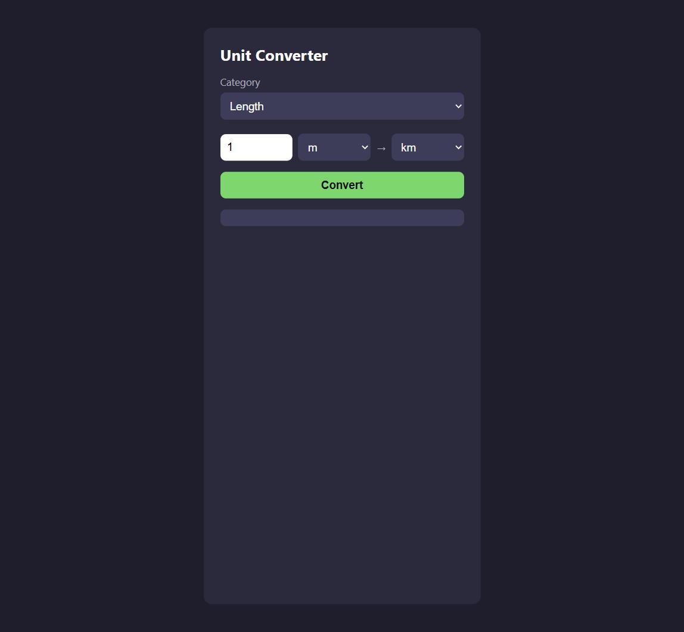
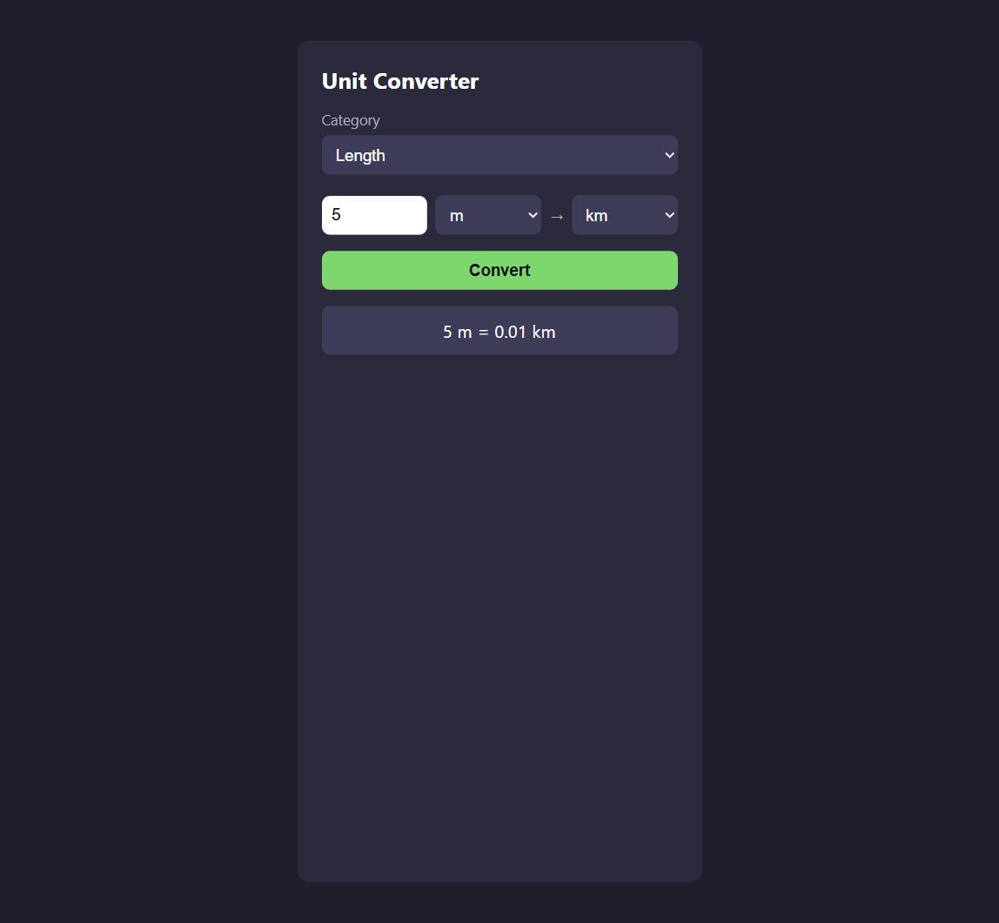

🇩🇪 Deutsch | 🇬🇧 [English](../en/01-unit-converter.md)

[← Zurück zur Kursübersicht](../../../README.de.md) · Verwandt: [Kurs 3 – Taschenrechner GUI](../../03-calculator-gui/de/01-taschenrechner-gui.md), [Kurs 4 – To-Do-Liste](../../04-todo-list/de/01-to-do-liste.md) (keiner davon nötig — falls du einen gemacht hast, werden dir die DOM-Teile weiter unten vertraut vorkommen)

# Kapitel 1 – Einheitenumrechner

**Ziel:** eine Seite bauen, die eine Zahl von einer Einheit in eine andere
umrechnet — Meter in Kilometer, Kilogramm in Pfund, Grad Celsius in
Fahrenheit. Dieser Kurs setzt nur
[Kurs 1 – Basics](../../01-basics/de/00-einleitung.md) voraus (Werte,
Variablen, Operatoren, Klammern, Funktionen, Bedingungen, Schleifen) und
sonst nichts; er steht vollständig für sich.

Die fertigen Referenzdateien liegen in
[`courses/05-unit-converter/code/`](../code/): `index.html`, `style.css`,
`script.js`. `index.html` und `style.css` sind so, wie sie sind, direkt
einsatzbereit — sie enthalten schon alles, was dieses Kapitel baut,
einschließlich der optionalen Teile weiter unten. `script.js` ist die
eigentliche Übung: kopiere alle drei Dateien in deinen eigenen
Arbeitsordner, leere deine Kopie von `script.js`, und bau sie Stück für
Stück wieder auf, während du das Kapitel durcharbeitest. Dieses Kapitel
gibt dir bewusst weniger fertigen Code als frühere — der Punkt ist, dass
du dir die Logik selbst erarbeitest, sobald du die nötigen Bausteine hast,
statt etwas nur abzutippen, das du vorgesetzt bekommst.

Hier ist das fertige Ergebnis, auf das du hinarbeitest:



## 🟢 Kern — Das Layout (HTML + CSS)

```html
<div class="app">
  <h1>Unit Converter</h1>

  <div class="convert-row">
    <input type="number" id="value-input" value="1" />
    <select id="from-select"></select>
    <span class="arrow">&rarr;</span>
    <select id="to-select"></select>
  </div>

  <button id="convert-button">Convert</button>

  <p id="result"></p>
</div>
```

Beide `<select>`-Elemente starten absichtlich leer — JavaScript füllt sie
gleich mit Einheiten. Die vollständige Version steht in
[`index.html`](../code/index.html) und [`style.css`](../code/style.css);
das Styling ist hier nicht der Fokus, du kannst es also gerne nur
überfliegen. (Die vollständige Datei hat außerdem ein
`<select id="category-select">` über dieser Markup — ignorier es erstmal,
es gehört zum optionalen Abschnitt weiter unten.)

Ab hier geht alles in `script.js` — das ist die Datei, die `index.html`
tatsächlich lädt. Starte mit:

```js
const fromSelect = document.getElementById("from-select");
const toSelect = document.getElementById("to-select");
const valueInput = document.getElementById("value-input");
const convertButton = document.getElementById("convert-button");
const result = document.getElementById("result");
```

## 🟢 Kern — Das DOM, kurz erklärt

*(Falls du Kurs 3 oder Kurs 4 gemacht hast, ist dir das alles schon
vertraut — spring direkt zum nächsten Abschnitt.)*

JavaScript sieht deine HTML-Tags nicht direkt — es sieht das **DOM**
(Document Object Model), die lebendige, speicherinterne Darstellung der
Seite im Browser. Ein paar Werkzeuge lassen dich Elemente finden, ihren
Inhalt lesen und ihnen Verhalten zuweisen:

- [`document.getElementById(...)`](https://developer.mozilla.org/de/docs/Web/API/Document/getElementById)
  findet ein Element anhand seiner `id` — genau das haben die fünf Zeilen
  oben gerade getan.
- Liest man `.value` bei einem Eingabefeld oder einem `<select>` aus,
  bekommt man, was der Benutzer aktuell eingetippt oder ausgewählt hat —
  immer als Text (String), sogar bei `<input type="number">`. Deshalb ist
  die Umwandlung mit `Number(...)` weiter unten wichtig.
- [`addEventListener("click", ...)`](https://developer.mozilla.org/de/docs/Web/API/EventTarget/addEventListener)
  bedeutet "führe diese Funktion aus, wann immer dieses Ereignis bei
  diesem Element eintritt." Die Funktion, die du übergibst
  (`() => { ... }`), ist eine
  [Arrow Function](https://developer.mozilla.org/de/docs/Web/JavaScript/Reference/Functions/Arrow_functions) —
  eine kürzere Schreibweise für eine kleine Funktion, besonders wenn du
  sie nur einmal, genau hier, brauchst.

## 🟢 Kern — Umrechnungen als Daten darstellen

Ein Einheitenumrechner muss für jede Einheit wissen, wie sie zu jeder
*anderen* Einheit in ihrer Kategorie steht. Für jedes mögliche Paar eine
eigene Berechnung zu schreiben (Meter→Kilometer, Kilometer→Meter,
Meter→Meilen, ...) würde Dutzende fast identischer Funktionen bedeuten. Es
gibt einen viel kleineren Weg: eine **Basiseinheit** wählen und
festhalten, wie viel jede Einheit davon wert ist. Für Längen sind Meter
eine naheliegende Basiseinheit:

```js
const lengthFactors = {
  m: 1,
  km: 1000,
  cm: 0.01,
  mm: 0.001,
  mi: 1609.34,
  ft: 0.3048,
};
```

Lies das als "1 km entspricht 1000 m," "1 cm entspricht 0.01 m," und so
weiter. Das ist dieselbe Objektliteral-Idee wie
[Kurs 4](../../04-todo-list/de/01-to-do-liste.md)s `{ key: value }`-Paare
(nicht vorausgesetzt — die Idee ist kurz genug, um sie hier zu
wiederholen): ein Paar geschweifter Klammern, das `key: value`-Paare
enthält und einen *Wert* erzeugt, den du in einer Variable speichern
kannst — anders als das `{}`, das in
[Kurs 1](../../01-basics/de/01-programmier-grundlagen.md) einen Block aus
Anweisungen umschließt. Hier ist jeder Schlüssel ein Einheitenname und
jeder Wert eine einfache Zahl statt etwas Komplexerem.

Mehr dazu: [MDN – Arbeiten mit Objekten](https://developer.mozilla.org/de/docs/Web/JavaScript/Guide/Working_with_objects).

## 🟢 Kern — Die Dropdowns aus Daten befüllen

Statt `<option>m</option>`, `<option>km</option>` und so weiter von Hand
ins HTML zu schreiben, baue sie aus `lengthFactors` auf — fügst du später
eine neue Einheit zum Objekt hinzu, taucht sie automatisch in den
Dropdowns auf:

```js
function createOption(unit) {
  const option = document.createElement("option");
  option.value = unit;
  option.textContent = unit;
  return option;
}

function populateUnitSelects() {
  const unitNames = Object.keys(lengthFactors);

  unitNames.forEach((unit) => {
    fromSelect.appendChild(createOption(unit));
    toSelect.appendChild(createOption(unit));
  });
}

populateUnitSelects();
```

Neue Teile hier:

- [`Object.keys(...)`](https://developer.mozilla.org/de/docs/Web/JavaScript/Reference/Global_Objects/Object/keys)
  gibt die Schlüssel eines Objekts als Array zurück — für
  `lengthFactors` ist das `["m", "km", "cm", "mm", "mi", "ft"]`.
- [`.forEach(...)`](https://developer.mozilla.org/de/docs/Web/JavaScript/Reference/Global_Objects/Array/forEach)
  führt eine Funktion einmal für jedes Element eines Arrays aus — hier
  einmal pro Einheitenname, statt eine Zeile pro Einheit von Hand zu
  schreiben.
- [`document.createElement(...)`](https://developer.mozilla.org/de/docs/Web/API/Document/createElement)
  baut ein brandneues Element, das noch nicht auf der Seite existiert,
  komplett im Speicher. `.value` und `.textContent` zu setzen füllt es;
  [`.appendChild(...)`](https://developer.mozilla.org/de/docs/Web/API/Node/appendChild)
  ist das, was es tatsächlich in die Seite einfügt, innerhalb des
  Elements, auf dem du es aufrufst. Das ist eine andere Technik als die
  Template-Literal-`innerHTML`-Strings aus Kurs 4 — beide bauen HTML aus
  Daten, nur mit unterschiedlichen Werkzeugen.
- Der Aufruf von `populateUnitSelects()` ganz unten führt die Funktion
  einmal sofort aus, damit die Seite schon beim Laden echte Optionen
  enthält.

Speichern, `index.html` neu laden — beide Dropdowns sollten jetzt jede
Längeneinheit auflisten.

## 🟢 Kern — Die Umrechnung durchführen

Diesen Teil hätten dir frühere Kurse fertig hingeschrieben — diesmal baust
du ihn selbst aus den Bausteinen oben zusammen. Einen Wert von einer
Längeneinheit in eine andere umzurechnen ist eine Berechnung in zwei
Schritten:

1. Den Eingabewert in Meter (die Basiseinheit) umwandeln, indem du ihn mit
   `lengthFactors[fromUnit]` multiplizierst.
2. Diesen Meter-Wert in die Zieleinheit umwandeln, indem du ihn durch
   `lengthFactors[toUnit]` teilst.

Zum Beispiel 5 km in m umrechnen: `5 * lengthFactors["km"]` ergibt 5000
(m), dann ergibt `5000 / lengthFactors["m"]` wieder 5000 (m), da Meter die
Basiseinheit sind. Umgekehrt 5000 m in km: `5000 * lengthFactors["m"]`
ergibt 5000 (immer noch Meter), dann ergibt `5000 / lengthFactors["km"]`
5.

Schreib eine Funktion, die das erledigt:

```js
function convert() {
  const value = Number(valueInput.value);
  const fromUnit = fromSelect.value;
  const toUnit = toSelect.value;

  // dein Code hier: `converted` mit den zwei Schritten oben berechnen

  result.textContent =
    value + " " + fromUnit + " = " + converted.toFixed(2) + " " + toUnit;
}

convertButton.addEventListener("click", convert);
```

[`.toFixed(2)`](https://developer.mozilla.org/de/docs/Web/JavaScript/Reference/Global_Objects/Number/toFixed)
rundet eine Zahl auf 2 Nachkommastellen und gibt sie als Text zurück —
ohne das würde eine Umrechnung wie 1 mi in km eine lange, hässliche
Dezimalzahl statt `1.61` ausgeben.

Speichern, `index.html` neu laden, einen Wert eintippen, zwei Einheiten
auswählen und auf **Convert** klicken. Sieht das Ergebnis falsch aus,
schau dir die Zwei-Schritte-Rechnung oben nochmal an — es passiert leicht,
dass man aus Versehen Multiplikation und Division vertauscht. Falls du
nicht weiterkommst: `convertLinear` in
[`code/script.js`](../code/script.js) zeigt einen Weg, wie man es
schreiben kann (dort ist die Funktion verallgemeinert und nimmt die
Umrechnungstabelle als vierten Parameter — mehr dazu im nächsten
Abschnitt).

## 🟡 Optional — Mehr als eine Kategorie

Aktuell rechnet das nur Längen um. Erweitere es um Gewicht, nach genau
demselben Prinzip:

1. Schreib dein eigenes `weightFactors`-Objekt, in derselben Form wie
   `lengthFactors` — wähl Kilogramm als Basiseinheit (`kg: 1`), dann
   füge `g`, `lb`, `oz` hinzu, mit dem Wert, wie viele Kilogramm jede
   Einheit entspricht. (Eine kurze Suche nach "1 pound in kg" liefert die
   Zahlen.)
2. Bemerke, dass die Umrechnungsfunktion, die du oben geschrieben hast,
   eigentlich nichts *längenspezifisches* enthält — sie kümmert sich nur
   darum, welche Tabelle sie ausliest. Verallgemeiner sie zu
   `convertLinear(value, fromUnit, toUnit, factors)`, mit der Tabelle als
   viertem Parameter, sodass dieselbe Funktion beide Kategorien bedient.
3. Füg das Kategorie-Dropdown aus dem vollständigen `index.html`
   (`<select id="category-select">`, mit `length` und `weight` als
   `<option>`s) zu deiner eigenen Kopie hinzu, plus ein
   `categories`-Objekt, das jeden Kategorienamen auf sein Faktoren-Objekt
   abbildet:
   ```js
   const categories = {
     length: lengthFactors,
     weight: weightFactors,
   };
   ```
4. Passe `populateUnitSelects` so an, dass es `categorySelect.value`
   liest, das passende Faktoren-Objekt in `categories` nachschlägt, und
   die Dropdowns vorher leert (`fromSelect.innerHTML = "";
   toSelect.innerHTML = "";`), bevor es sie neu aufbaut — sonst stapeln
   sich beim Kategoriewechsel nur neue Optionen auf die alten.
5. Reagiere darauf, wenn sich das Kategorie-Dropdown ändert, und befülle
   dann neu:
   `categorySelect.addEventListener("change", populateUnitSelects);`

Vergleich mit [`code/script.js`](../code/script.js), sobald es
funktioniert, oder falls du bei einem der Schritte nicht weiterkommst.

## 🔴 Optional, echte Herausforderung — Temperatur

Temperatur passt überhaupt nicht in das Nachschlagetabellen-Muster von
oben. 1 °C ist nicht "wert" eine feste Anzahl °F, so wie 1 km eine feste
Anzahl m wert ist — von Celsius zu Fahrenheit zu wechseln bedeutet sowohl
Multiplizieren *als auch* einen Versatz addieren (0 °C sind 32 °F, nicht
0 °F). Eine einzelne `factors`-Tabelle kann das nicht abbilden, also
braucht das eine eigene Funktion mit eigenen Formeln:

- Celsius zu Fahrenheit: `celsius * (9 / 5) + 32`
- Fahrenheit zu Celsius: `(fahrenheit - 32) * (5 / 9)`
- Celsius zu Kelvin: `celsius + 273.15`
- Kelvin zu Celsius: `kelvin - 273.15`

Ein sauberer Weg, alle drei Einheiten (C, F, K) zu unterstützen, ohne
sechs einzelne Formeln zu schreiben: zuerst *nach* Celsius umrechnen,
egal wie die Eingabe beschriftet ist, dann *aus* Celsius heraus in die
Zieleinheit — genau die "erst auf eine gemeinsame Basis, dann von dort
weiter" Idee aus dem Kernabschnitt, nur dass eine Formel die Stelle der
Basiseinheiten-Division einnimmt. Schreib
`convertTemperature(value, fromUnit, toUnit)` selbst, und häng sie dann
so in `convert()` ein, dass Temperatur sie benutzt, während Länge und
Gewicht weiter `convertLinear` verwenden.
`courses/05-unit-converter/code/script.js` hat eine funktionierende
Version, falls du deinen Ansatz danach überprüfen willst.

## Probier es selbst aus

Rechne 5 Meter in Kilometer um — du solltest 0.01 bekommen:



Öffne [`courses/05-unit-converter/code/index.html`](../code/index.html) in
deinem Browser — Doppelklick auf die Datei funktioniert problemlos, da
alles lokal läuft, ohne externe Anfragen.

## Checkpoint & was du gelernt hast

- Das Nachschlagetabellen-Muster: eine Basiseinheit wählen und für jede
  andere Einheit ihr Verhältnis dazu festhalten, statt eine Funktion pro
  Einheitenpaar zu schreiben
- HTML-Elemente aus Daten bauen mit `document.createElement` und
  `.appendChild`, als Alternative zum `innerHTML`-Template-String-Ansatz
- `Object.keys(...)`, `.forEach(...)`, `Number(...)`, `.toFixed(...)`
- Eine Funktion verallgemeinern, indem man etwas, das sie vorausgesetzt
  hat (welche Tabelle benutzt wird), stattdessen zu einem Parameter macht
- Warum eine lineare, verhältnisbasierte Umrechnung (Länge, Gewicht) und
  eine versatzbasierte (Temperatur) wirklich unterschiedlichen Code
  brauchen

## Was als Nächstes kommt

Dieser Kurs steht für sich. Für eine größere Auswahl, was als Nächstes zu
bauen wäre, siehe [PROJECT-IDEAS.de.md](../../../PROJECT-IDEAS.de.md).
