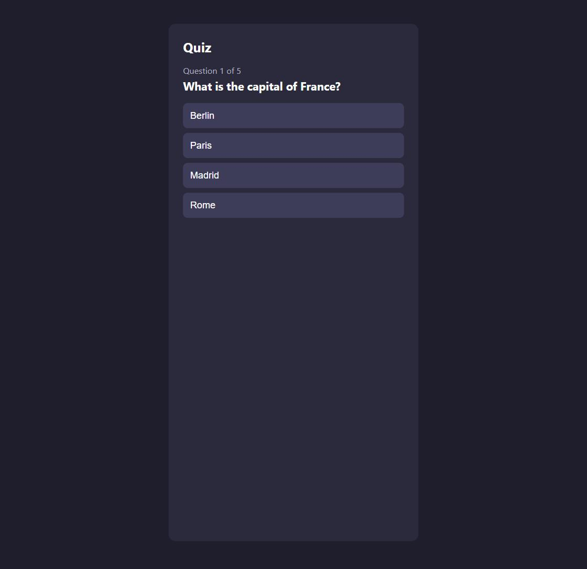
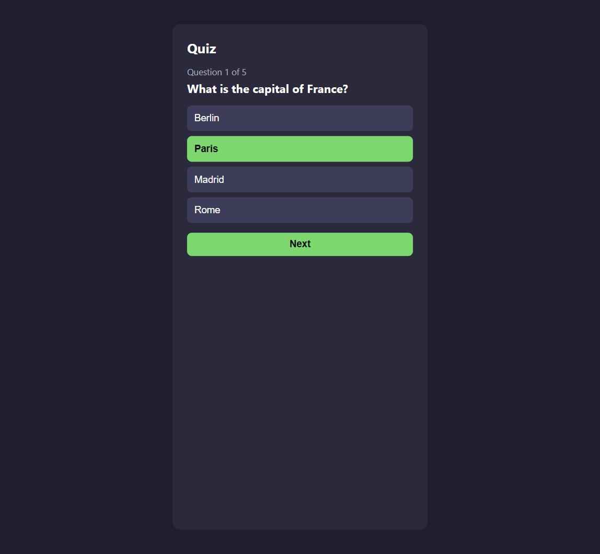
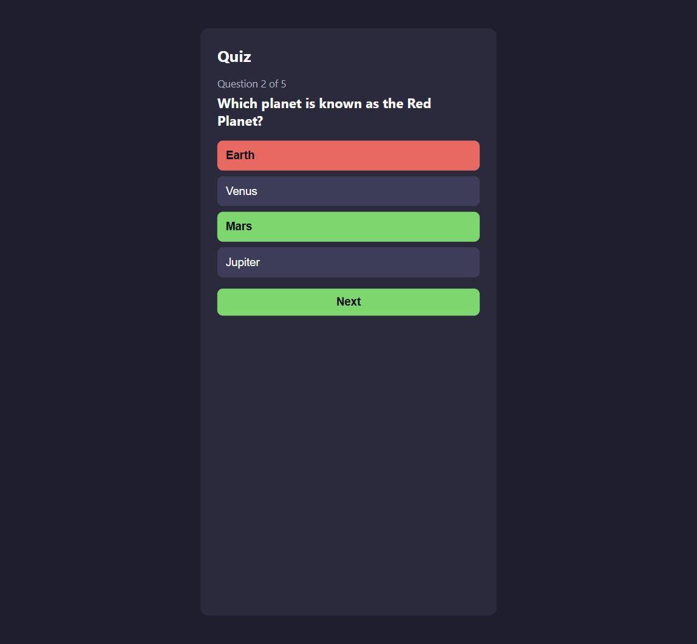
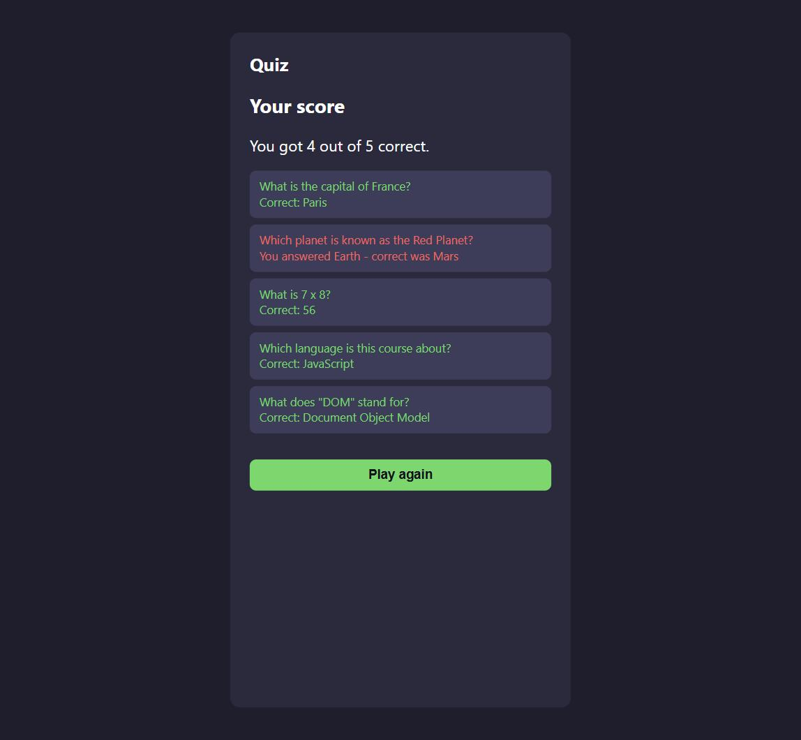

🇬🇧 English | 🇩🇪 [Deutsch](../de/01-quiz.md)

[← Back to course overview](../../../README.md) · Related: [Course 3 – Calculator GUI](../../03-calculator-gui/en/01-calculator-gui.md), [Course 4 – To-Do List](../../04-todo-list/en/01-todo-list.md), [Course 5 – Unit Converter](../../05-unit-converter/en/01-unit-converter.md) (none required; if you've done any of them, some of the pieces below will feel familiar)

# Chapter 1 – Quiz

**Goal:** build a multiple-choice quiz that shows one question at a time,
keeps score, gives feedback on every answer, and ends on a result screen
you can review or replay. This course assumes
[Course 1 – Basics](../../01-basics/en/00-introduction.md) only (values,
variables, operators, brackets, functions, conditionals, loops) and
nothing else; it stands entirely on its own.

The finished reference files live in
[`courses/06-quiz/code/`](../code/): `index.html`, `style.css`,
`script.js`. `index.html` and `style.css` are ready to use as they are:
they already include everything this chapter builds, including the
optional parts further down. `script.js` is the actual exercise: copy all
three files into your own working folder, empty out your copy of
`script.js`, and build it back up one piece at a time. Like
[Course 5](../../05-unit-converter/en/01-unit-converter.md), this chapter
holds back more of the finished code than the earliest courses did. You
get the new building blocks explained, and you assemble the actual logic
yourself.

Here's the finished result you're working towards:



## 🟢 Core — The layout (HTML + CSS)

```html
<div class="app">
  <h1>Quiz</h1>

  <div id="question-screen">
    <p id="progress"></p>
    <h2 id="question-text"></h2>
    <ul id="options-list"></ul>
    <button id="next-button" class="hidden">Next</button>
  </div>

  <div id="result-screen" class="hidden">
    <h2>Your score</h2>
    <p id="score-text"></p>
    <ul id="review-list"></ul>
    <button id="restart-button">Play again</button>
  </div>
</div>
```

Two things worth noticing:

- `#options-list` starts empty on purpose: JavaScript fills it with one
  `<button>` per answer, built from data, exactly like Course 4's task
  list or Course 5's dropdowns filled themselves in.
- `#result-screen` has a `class="hidden"` from the start, and `.hidden`
  is just a CSS class in [`style.css`](../code/style.css) that sets
  `display: none;`. There's no special browser feature here. Showing or
  hiding a whole section of the page is just adding or removing an
  ordinary class, the same way `task.done` added a `done` class in
  Course 4.

See the full version in [`index.html`](../code/index.html) and
[`style.css`](../code/style.css); the styling isn't the focus here, so
feel free to just skim it.

From here on, everything goes into `script.js`, the file `index.html`
actually loads. Start it with:

```js
const questionScreen = document.getElementById("question-screen");
const resultScreen = document.getElementById("result-screen");
const progress = document.getElementById("progress");
const questionText = document.getElementById("question-text");
const optionsList = document.getElementById("options-list");
const nextButton = document.getElementById("next-button");
const scoreText = document.getElementById("score-text");
const restartButton = document.getElementById("restart-button");
```

## 🟢 Core — The DOM, in short

*(If you've done Course 3, 4, or 5, all of this will be familiar. Skip
ahead to the next section.)*

JavaScript doesn't see your HTML tags directly. Instead, it sees the
**DOM** (Document Object Model), the browser's live, in-memory
representation of the page. This chapter needs a handful of DOM tools:

- [`document.getElementById(...)`](https://developer.mozilla.org/en-US/docs/Web/API/Document/getElementById)
  finds one element by its `id`; that's what the lines above just did.
- [`document.querySelectorAll(...)`](https://developer.mozilla.org/en-US/docs/Web/API/Document/querySelectorAll)
  finds *every* matching element for a CSS-style selector, as a list you
  can loop over with
  [`.forEach(...)`](https://developer.mozilla.org/en-US/docs/Web/JavaScript/Reference/Global_Objects/Array/forEach),
  used below to handle every answer button at once, however many there
  are.
- [`addEventListener("click", ...)`](https://developer.mozilla.org/en-US/docs/Web/API/EventTarget/addEventListener)
  says "run this function whenever this event happens on this element."
- [`.classList.add(...)`/`.classList.remove(...)`](https://developer.mozilla.org/en-US/docs/Web/API/Element/classList)
  add or remove a single CSS class from an element without disturbing any
  others it already has. That's how the `.hidden` class above gets
  toggled, and how an answer button gets marked `.correct` or `.wrong`.
- `.dataset` reads a `data-*` attribute back out of an element (always as
  a string), the same custom-data-attribute idea from Course 3 or 4, used
  below to know which option index a clicked button represents.

## 🟢 Core — Classes, in short

*(If you've done Course 3, all of this will be familiar. Skip ahead to
the next section.)*

A **class** is a template for creating objects that all share the same
shape and the same behavior. Instead of writing out `{ text: ..., options:
..., correctIndex: ... }` by hand for every single question, you describe
the shape once:

```js
class Question {
  constructor(text, options, correctIndex) {
    this.text = text;
    this.options = options;
    this.correctIndex = correctIndex;
  }

  isCorrect(optionIndex) {
    return optionIndex === this.correctIndex;
  }
}
```

- The [`constructor`](https://developer.mozilla.org/en-US/docs/Web/JavaScript/Reference/Classes/constructor)
  runs whenever you create a new question, and sets up its data.
- [`this`](https://developer.mozilla.org/en-US/docs/Web/JavaScript/Reference/Operators/this)
  refers to "the specific question object being built or used right now".
  `this.text = text` stores the argument on that particular object.
- `isCorrect(...)` is a **method**: a function that lives on the class and
  can use `this` to look at the object's own data. Every question you
  create gets its own copy of the data, but shares the same `isCorrect`
  logic.
- `new Question("...", [...], 1)`, built with the
  [`new`](https://developer.mozilla.org/en-US/docs/Web/JavaScript/Reference/Operators/new)
  keyword, creates one actual question object using that template.

More: [MDN – Classes](https://developer.mozilla.org/en-US/docs/Web/JavaScript/Reference/Classes).

## 🟢 Core — Modeling the questions

```js
const questions = [
  new Question("What is the capital of France?", ["Berlin", "Paris", "Madrid", "Rome"], 1),
  new Question("Which planet is known as the Red Planet?", ["Earth", "Venus", "Mars", "Jupiter"], 2),
  new Question("What is 7 x 8?", ["54", "56", "58", "64"], 1),
];

let currentIndex = 0;
let score = 0;
let answered = false;
```

Feel free to write your own questions instead of copying these. The
`correctIndex` is just the position (starting at 0) of the right answer in
the `options` array. `answered` tracks whether the current question has
already been clicked, so a second click on another option doesn't change
your score after the fact.

## 🟢 Core — Rendering the current question

```js
function renderQuestion() {
  const question = questions[currentIndex];

  progress.textContent = "Question " + (currentIndex + 1) + " of " + questions.length;
  questionText.textContent = question.text;

  optionsList.innerHTML = question.options
    .map((option, index) => '<li><button class="option" data-index="' + index + '">' + option + "</button></li>")
    .join("");

  optionsList.querySelectorAll(".option").forEach((button) => {
    button.addEventListener("click", () => {
      handleAnswer(Number(button.dataset.index));
    });
  });

  nextButton.classList.add("hidden");
  answered = false;
}

renderQuestion();
```

This is the same "throw away the old HTML, build fresh HTML from data,
then re-attach listeners to the new elements" pattern Course 4 used for
its task list, applied to answer buttons instead of tasks. The call to
`renderQuestion()` at the bottom runs it once immediately, so the first
question is on screen as soon as the page loads.

## 🟢 Core — Checking an answer

This is where you take over. `handleAnswer(selectedIndex)` runs when a
player clicks one of the option buttons; `selectedIndex` is whichever
one they clicked. It needs to:

1. Do nothing if this question has already been answered (check
   `answered`, `return` early if so).
2. Mark it answered.
3. Ask the current question whether `selectedIndex` was correct (that's
   exactly what `isCorrect(...)` is for), and add 1 to `score` if so.
4. Go through every option button (`optionsList.querySelectorAll(".option")`,
   with `.forEach((button, index) => { ... })`) and:
   - disable it (`button.disabled = true;`), so nothing can be clicked
     again this round,
   - if `index` is the question's `correctIndex`, add the `"correct"`
     class to it,
   - otherwise, if `index` is the `selectedIndex` that got clicked, add
     the `"wrong"` class to it (a right answer clicked has already gotten
     `"correct"` from the rule above, so it's never both).
5. Reveal the "Next" button (`nextButton.classList.remove("hidden");`).

```js
function handleAnswer(selectedIndex) {
  // your code here — the five steps above
}
```

Save, reload `index.html`, and click an answer: the correct option should
turn green, and a wrong pick should turn red while the right one still
turns green next to it. If you get stuck, `handleAnswer` in
[`code/script.js`](../code/script.js) shows one way to write it.

## 🟢 Core — Moving on, and showing the result

Two more functions, and the quiz is playable start to finish:

```js
nextButton.addEventListener("click", nextQuestion);

function nextQuestion() {
  // your code here:
  // - add 1 to currentIndex
  // - if currentIndex is still a valid position in `questions`, call renderQuestion() again
  // - otherwise, the quiz is over — call showResult() instead
}

function showResult() {
  // your code here:
  // - hide questionScreen, show resultScreen (classList, same as the "hidden" class above)
  // - set scoreText.textContent to something like "You got 4 out of 5 correct."
}
```

Try it end to end: answer every question, and the result screen should
appear showing your score.

## 🟡 Optional — Shuffle the answer order

Right now, the correct answer always sits at the same `options` index
every time you play. Reshuffle `question.options` (and remember to
recompute where the correct answer ended up, since `correctIndex` was
written assuming the original order) before rendering each question, so
replaying doesn't mean memorizing option positions instead of answers.

## 🔴 Optional, genuine challenge — Review your answers

The result screen's `<ul id="review-list"></ul>` is there for this:
after the quiz ends, list every question again, showing what you
answered and what the correct answer actually was. You'll need to start
remembering each answer as it happens: e.g. an `answers` array that
`handleAnswer` `.push()`es `{ question, selectedIndex, isCorrect }` onto,
and then, in `showResult()`, build the review list's HTML from that array
using the same `.map(...)`/`.join(...)` pattern `renderQuestion()` already
uses for options. `courses/06-quiz/code/script.js` has one working
version, including a "Play again" button that resets everything and calls
`renderQuestion()` again, if you want to take the quiz further.

## Try it yourself

Answer a question correctly, and the right option turns green:



Answer one wrong, and both your (wrong) pick and the correct answer light
up:



Finish all the questions to see your score and a review of every answer:



Open [`courses/06-quiz/code/index.html`](../code/index.html) in your
browser. Double-clicking the file works fine, since everything is local
with no external requests.

## Checkpoint & what you learned

- Classes as templates for objects that share shape and behavior:
  `constructor`, `this`, methods, `new`
- Modeling a small quiz as an array of objects (or class instances), the
  same idea as Course 4's task list applied to a different domain
- Re-rendering from data and re-attaching listeners after every render
- `.classList.add(...)`/`.remove(...)` for toggling both a single button's
  feedback state and an entire screen's visibility
- Breaking a feature into named functions (`handleAnswer`, `nextQuestion`,
  `showResult`) that each do one clear thing

## What's next

This course stands on its own. For a broader menu of what to build next,
see [PROJECT-IDEAS.md](../../../PROJECT-IDEAS.md).
