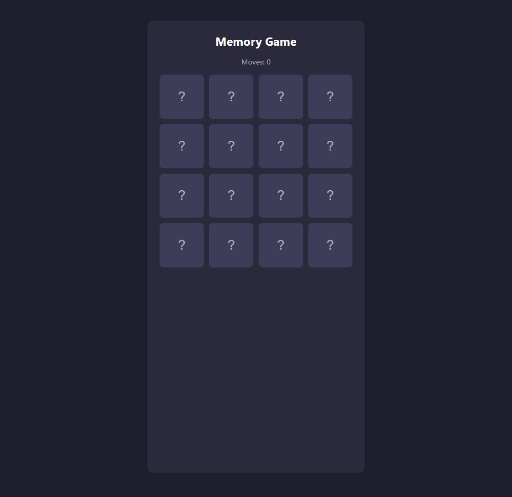
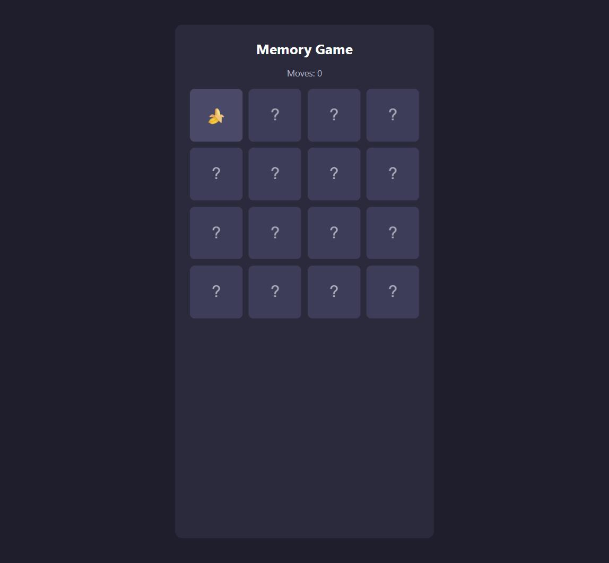

🇩🇪 Deutsch | 🇬🇧 [English](../en/01-memory-game.md)

[← Zurück zur Kursübersicht](../../../README.de.md) · Verwandt: [Kurs 3 – Taschenrechner GUI](../../03-calculator-gui/de/01-taschenrechner-gui.md), [Kurs 4 – To-Do-Liste](../../04-todo-list/de/01-to-do-liste.md), [Kurs 6 – Quiz](../../06-quiz/de/01-quiz.md) (keiner davon nötig — falls du einen gemacht hast, werden dir manche Teile weiter unten vertraut vorkommen)

# Kapitel 1 – Memory-Spiel

**Ziel:** ein Karten-Memory-Spiel bauen — ein gemischtes Raster aus
verdeckten Karten, zwei anklicken um sie aufzudecken, bei einem Treffer
aufgedeckt lassen, und nach einem Moment wieder umdrehen, wenn sie nicht
zusammenpassen. Dieser Kurs setzt nur
[Kurs 1 – Basics](../../01-basics/de/00-einleitung.md) voraus (Werte,
Variablen, Operatoren, Klammern, Funktionen, Bedingungen, Schleifen) und
sonst nichts; er steht vollständig für sich.

Die fertigen Referenzdateien liegen in
[`courses/07-memory-game/code/`](../code/): `index.html`, `style.css`,
`script.js`. `index.html` und `style.css` sind so, wie sie sind, direkt
einsatzbereit. `script.js` ist die eigentliche Übung: kopiere alle drei
Dateien in deinen eigenen Arbeitsordner, leere deine Kopie von
`script.js`, und bau sie Stück für Stück wieder auf. Wie in
[Kurs 5](../../05-unit-converter/de/01-einheitenumrechner.md) und
[Kurs 6](../../06-quiz/de/01-quiz.md) bleibt der kniffligste Teil (zu
entscheiden, was beim Klick auf eine Karte passiert) dir überlassen, aus
beschriebenen Schritten zusammengesetzt, statt fertig geschrieben
vorzuliegen.

Hier ist das fertige Ergebnis, auf das du hinarbeitest:



## 🟢 Kern — Das Layout (HTML + CSS)

```html
<div class="app">
  <h1>Memory Game</h1>
  <p id="moves">Moves: 0</p>

  <div id="board" class="board"></div>

  <div id="win-message" class="hidden">
    <p>You won in <span id="final-moves"></span> moves!</p>
    <button id="restart-button">Play again</button>
  </div>
</div>
```

`#board` startet leer — JavaScript füllt es mit jeweils einem
Karten-Button pro Karte, aus Daten aufgebaut, dieselbe Idee wie jedes
Raster oder jede Liste in früheren Kursen. Jeder Karten-Button wird so
aufgebaut:

```html
<button class="card" data-index="0">
  <span class="card-inner">
    <span class="card-face card-front">?</span>
    <span class="card-face card-back">🍎</span>
  </span>
</button>
```

Die vollständige Version steht in [`index.html`](../code/index.html) und
[`style.css`](../code/style.css). Ein Blick ins CSS lohnt sich trotzdem,
auch wenn du es nicht selbst schreiben musst: eine Karte hat *zwei*
Seiten (`.card-front` zeigt `?`, `.card-back` zeigt den echten Wert),
übereinandergelegt mit `backface-visibility: hidden`, und das Umschalten
einer einzigen `.flipped`- (oder `.matched`-)Klasse an der Karte dreht den
ganzen Stapel um 180 Grad mit `transform: rotateY(180deg)`. Ein
`transition: transform 0.4s` auf `.card-inner` sorgt dafür, dass diese
Drehung sanft animiert statt sofort umzuspringen — dieselbe
`transition`-Eigenschaft könntest du genauso auf Farb-, Größen- oder
Positionsänderungen anwenden.

Ab hier geht alles in `script.js` — das ist die Datei, die `index.html`
tatsächlich lädt. Starte mit:

```js
const board = document.getElementById("board");
const movesText = document.getElementById("moves");
const winMessage = document.getElementById("win-message");
const finalMoves = document.getElementById("final-moves");
const restartButton = document.getElementById("restart-button");
```

## 🟢 Kern — Das DOM, kurz erklärt

*(Falls du Kurs 3, 4, 5 oder 6 gemacht hast, ist dir das alles schon
vertraut — spring direkt zum nächsten Abschnitt.)*

JavaScript sieht deine HTML-Tags nicht direkt — es sieht das **DOM**
(Document Object Model), die lebendige, speicherinterne Darstellung der
Seite im Browser. Dieses Kapitel braucht:

- [`document.getElementById(...)`](https://developer.mozilla.org/de/docs/Web/API/Document/getElementById)
  findet ein Element anhand seiner `id`.
- [`document.querySelectorAll(...)`](https://developer.mozilla.org/de/docs/Web/API/Document/querySelectorAll)
  findet jedes passende Element als Liste, über die du mit
  [`.forEach(...)`](https://developer.mozilla.org/de/docs/Web/JavaScript/Reference/Global_Objects/Array/forEach)
  iterieren kannst.
- [`addEventListener("click", ...)`](https://developer.mozilla.org/de/docs/Web/API/EventTarget/addEventListener)
  bedeutet "führe diese Funktion aus, wann immer dieses Ereignis bei
  diesem Element eintritt."
- `.classList.add(...)`/`.classList.remove(...)` fügen eine einzelne
  CSS-Klasse zu einem Element hinzu oder entfernen sie — so wird die
  `.flipped`-Klasse einer Karte (und die `.hidden`-Klasse der
  Gewinnnachricht) umgeschaltet.
- `.dataset` liest ein `data-*`-Attribut aus einem Element wieder aus
  (immer als Text) — weiter unten benutzt, um zu wissen, welchen
  Karten-Index ein angeklickter Button darstellt.

## 🟢 Kern — Die Karten modellieren

Jede Karte braucht drei Dinge: welchen Wert sie zeigt, ob sie gerade
aufgedeckt ist, und ob sie schon zugeordnet (gematcht) wurde:

```js
const emojis = ["🍎", "🍌", "🍇", "🍒", "🍋", "🍉", "🍓", "🍍"];

let cards = [];
let firstIndex = null;
let isChecking = false;
let moves = 0;
```

`cards` enthält gleich ein Objekt pro Karte, wie `{ value: "🍎", flipped:
false, matched: false }` — das Objektliteral-Muster aus früheren Kursen
(ein Paar geschweifter Klammern mit `key: value`-Paaren, das einen Wert
erzeugt, den du speichern kannst, anders als das `{}`, das einen Block
aus Anweisungen umschließt). `firstIndex` merkt sich die Position der
ersten aufgedeckten Karte des aktuellen Paares (oder `null`, wenn gerade
keine Karte auf ihren Partner wartet), und `isChecking` wird relevant,
sobald es um Fehlversuche geht, weiter unten.

## 🟢 Kern — Das Kartendeck mischen und aufbauen

Acht Emoji, jedes davon zweimal gebraucht, gemischt auf zufällige
Positionen:

```js
function shuffle(array) {
  const result = array.slice();
  for (let i = result.length - 1; i > 0; i--) {
    const j = Math.floor(Math.random() * (i + 1));
    const temp = result[i];
    result[i] = result[j];
    result[j] = temp;
  }
  return result;
}

function createCards() {
  const pairedValues = emojis.concat(emojis);
  const shuffledValues = shuffle(pairedValues);
  return shuffledValues.map((value) => ({ value: value, flipped: false, matched: false }));
}

cards = createCards();
```

- [`.slice()`](https://developer.mozilla.org/de/docs/Web/JavaScript/Reference/Global_Objects/Array/slice)
  ohne Argumente kopiert ein ganzes Array — `shuffle` kopiert seine
  Eingabe zuerst, damit es die Kopie umordnet, nicht das Array, das
  übergeben wurde.
- [`.concat(...)`](https://developer.mozilla.org/de/docs/Web/JavaScript/Reference/Global_Objects/Array/concat)
  fügt zwei Arrays zu einem neuen zusammen — `emojis.concat(emojis)` ist
  jedes Emoji zweimal, 16 Werte für 16 Karten.
- [`Math.random()`](https://developer.mozilla.org/de/docs/Web/JavaScript/Reference/Global_Objects/Math/random)
  gibt eine zufällige Dezimalzahl zwischen 0 (inklusive) und 1 (exklusive)
  zurück; [`Math.floor(...)`](https://developer.mozilla.org/de/docs/Web/JavaScript/Reference/Global_Objects/Math/floor)
  rundet ab auf eine ganze Zahl. Zusammen wählt `Math.floor(Math.random()
  * (i + 1))` eine zufällige ganze Zahl von 0 bis `i`.
- Die Schleife ist der **Fisher-Yates-Shuffle**: von hinten nach vorne
  durchs Array gehen und jede Position mit einer zufälligen früheren
  (oder gleichen) Position tauschen. Das ist ein Standard-Algorithmus mit
  Namen — etwas, das man kennen sollte, nicht etwas, das man selbst
  erfinden muss.

## 🟢 Kern — Das Spielfeld rendern

```js
function cardClass(card) {
  if (card.matched) {
    return "card matched";
  }
  if (card.flipped) {
    return "card flipped";
  }
  return "card";
}

function renderCards() {
  board.innerHTML = cards
    .map((card, index) => {
      const stateClass = cardClass(card);
      return (
        '<button class="' + stateClass + '" data-index="' + index + '">' +
          '<span class="card-inner">' +
            '<span class="card-face card-front">?</span>' +
            '<span class="card-face card-back">' + card.value + "</span>" +
          "</span>" +
        "</button>"
      );
    })
    .join("");

  board.querySelectorAll(".card").forEach((button) => {
    button.addEventListener("click", () => {
      handleCardClick(Number(button.dataset.index));
    });
  });

  movesText.textContent = "Moves: " + moves;
}

renderCards();
```

Dasselbe "altes HTML wegwerfen, aus Daten neu aufbauen, dann Listener an
die neuen Elemente neu anhängen"-Muster wie bei den Listen früherer
Kurse — hier entscheidet `cardClass(card)` rein aus den Daten der
jeweiligen Karte, welche CSS-Klassen (und damit welches auf- oder
zugedeckte Aussehen) jeder Button bekommt. Speichern, `index.html` neu
laden, und du solltest ein volles Raster verdeckter Karten sehen.

## 🟢 Kern — Eine Karte umdrehen und auf Übereinstimmung prüfen

Hier übernimmst du. Zuerst ein kurzer Abstecher: dieses Kapitel braucht
[`setTimeout(...)`](https://developer.mozilla.org/de/docs/Web/API/Window/setTimeout),
das eine Funktion für später einplant, ohne währenddessen irgendetwas
anderes anzuhalten:

```js
console.log("first");
setTimeout(() => {
  console.log("second, after a short pause");
}, 1000);
console.log("third");
```

Das gibt "first" aus, dann sofort "third", und "second, after a short
pause" etwa eine Sekunde (1000 Millisekunden) später — der Rest deines
Codes wartet nicht auf den Timer. Genau das braucht es, um ein
nicht-passendes Paar kurz zu zeigen und danach automatisch wieder
umzudrehen.

Jetzt läuft `handleCardClick(index)`, wann immer eine Karte angeklickt
wird — `index` ist die Position der angeklickten Karte. Die Funktion
muss:

1. Nichts tun, wenn `isChecking` `true` ist (ein nicht-passendes Paar
   wird gerade noch gezeigt), oder wenn die angeklickte Karte schon
   aufgedeckt oder schon zugeordnet ist (`cards[index].flipped`/
   `cards[index].matched` prüfen, bei Bedarf mit `return` sofort
   aufhören).
2. Die angeklickte Karte aufdecken (`cards[index].flipped = true;`), dann
   neu rendern, damit sie sofort sichtbar wird.
3. Wenn `firstIndex` `null` ist, ist das die erste Karte eines neuen
   Paares — `firstIndex = index` setzen und hier aufhören.
4. Andernfalls ist das die zweite Karte des Paares — `checkForMatch(
   firstIndex, index)` aufrufen, dann `firstIndex` wieder auf `null`
   zurücksetzen.

```js
function handleCardClick(index) {
  // dein Code hier — die vier Schritte oben
}
```

`checkForMatch(a, b)` vergleicht die zwei aufgedeckten Karten an den
Positionen `a` und `b`:

1. 1 zu `moves` addieren — jedes geprüfte Paar zählt als ein Zug, egal ob
   es passt oder nicht.
2. Wenn `cards[a].value === cards[b].value`: beide auf `matched = true`
   setzen, neu rendern, und prüfen, ob jetzt jede Karte zugeordnet ist
   (siehe unten).
3. Andernfalls: `isChecking = true` setzen (blockiert weitere Klicks —
   siehe Schritt 1 oben), dann mit `setTimeout(...)` nach einer kurzen
   Verzögerung (z. B. 800 Millisekunden) beide Karten wieder umdrehen
   (`cards[a].flipped = false; cards[b].flipped = false;`),
   `isChecking = false` setzen, und neu rendern.

```js
function checkForMatch(a, b) {
  // dein Code hier — die drei Schritte oben
}

function checkWin() {
  const allMatched = cards.every((card) => card.matched);
  if (allMatched) {
    winMessage.classList.remove("hidden");
    finalMoves.textContent = moves;
  }
}
```

[`.every(...)`](https://developer.mozilla.org/de/docs/Web/JavaScript/Reference/Global_Objects/Array/every)
prüft, ob eine Funktion für *jedes* Element eines Arrays `true`
zurückgibt — hier, ob bei jeder Karte `matched` `true` ist. `checkWin()`
ist oben schon für dich fertig geschrieben; ruf sie aus `checkForMatch`
auf, sobald du ein Paar als zugeordnet markiert hast.

Speichern, neu laden, und zwei Karten anklicken: ein Treffer sollte
aufgedeckt bleiben und leicht grün werden, ein Fehlversuch sollte sich
nach unter einer Sekunde wieder umdrehen. Beende das ganze Raster, und
die Gewinnnachricht sollte mit deiner Zuganzahl erscheinen. Falls du
nicht weiterkommst: `handleCardClick` und `checkForMatch` in
[`code/script.js`](../code/script.js) zeigen einen Weg, wie man sie
schreiben kann.

## 🟡 Optional — Nochmal spielen

Der "Play again"-Button der Gewinnnachricht (`restartButton`) tut noch
nichts. Schreib eine Funktion `restartGame()`, die alles wieder auf einen
frischen Start zurücksetzt: ein neu gemischtes `cards`-Array
(`createCards()` erledigt das Mischen schon), `moves` zurück auf 0,
`firstIndex` zurück auf `null`, `isChecking` zurück auf `false`, die
Gewinnnachricht wieder verstecken, und neu rendern. Verdrahte sie dann
mit `restartButton.addEventListener("click", restartGame);`.

## 🔴 Optional, echte Herausforderung — Deine Bestzeit merken

Nutz [`localStorage`](https://developer.mozilla.org/de/docs/Web/API/Window/localStorage)
(denselben dauerhaften Schlüssel-Wert-Speicher des Browsers aus
[Kurs 4](../../04-todo-list/de/01-to-do-liste.md), hier nicht
vorausgesetzt), um über Seiten-Neuladen hinweg die wenigsten Züge zu
merken, mit denen du je ein Spiel beendet hast. Wenn `checkWin()`
feststellt, dass das Spiel gewonnen ist, vergleiche `moves` mit dem, was
gespeichert ist (beim allerersten Mal ist nichts gespeichert; überleg
dir, was das bedeuten soll), und wenn dieses Spiel weniger Züge gebraucht
hat, speichere die neue Bestzeit und zeig sie neben dem aktuellen
Ergebnis, z. B. "You won in 9 moves! (Best: 7)". Da du eine einzelne Zahl
statt eines ganzen Arrays aus Objekten speicherst, braucht das weniger
`JSON.stringify`/`JSON.parse`-Aufwand als in Kurs 4. Eine Zahl übersteht
den Umweg über `localStorage` als Text problemlos, mit `Number(...)` auf
dem Rückweg.

## Probier es selbst aus

Klick eine Karte an, um sie aufzudecken:



Finde jedes Paar, um die Gewinnnachricht und deine Zuganzahl zu sehen:


Öffne [`courses/07-memory-game/code/index.html`](../code/index.html) in
deinem Browser — Doppelklick auf die Datei funktioniert problemlos, da
alles lokal läuft, ohne externe Anfragen.

## Checkpoint & was du gelernt hast

- Spielzustand als Array kleiner Objekte modellieren (`value`, `flipped`,
  `matched`) und das ganze Spielfeld bei jeder Änderung neu daraus
  rendern
- Der Fisher-Yates-Shuffle als Standard-Algorithmus zum Wiederverwenden
- `setTimeout(...)`, um etwas für später einzuplanen, ohne den Rest
  deines Codes anzuhalten — und warum das für einen
  "zeigen, dann wieder verstecken"-Effekt wichtig ist
- Eine reine CSS-Flip-Animation: zwei übereinandergelegte Seiten,
  `backface-visibility: hidden`, und ein `transition` auf
  `transform: rotateY(...)`
- `.slice()`, `.concat()`, `.every(...)`, `Math.random()`, `Math.floor(...)`
- Eine Interaktion (Klick auf eine Karte) in eine schnelle
  "Klick verarbeiten"-Funktion und eine separate
  "Ergebnis prüfen"-Funktion aufteilen

## Was als Nächstes kommt

Dieser Kurs steht für sich. Für eine größere Auswahl, was als Nächstes zu
bauen wäre, siehe [PROJECT-IDEAS.de.md](../../../PROJECT-IDEAS.de.md).
