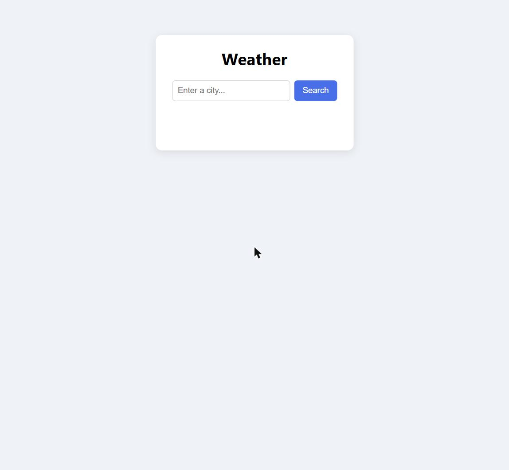
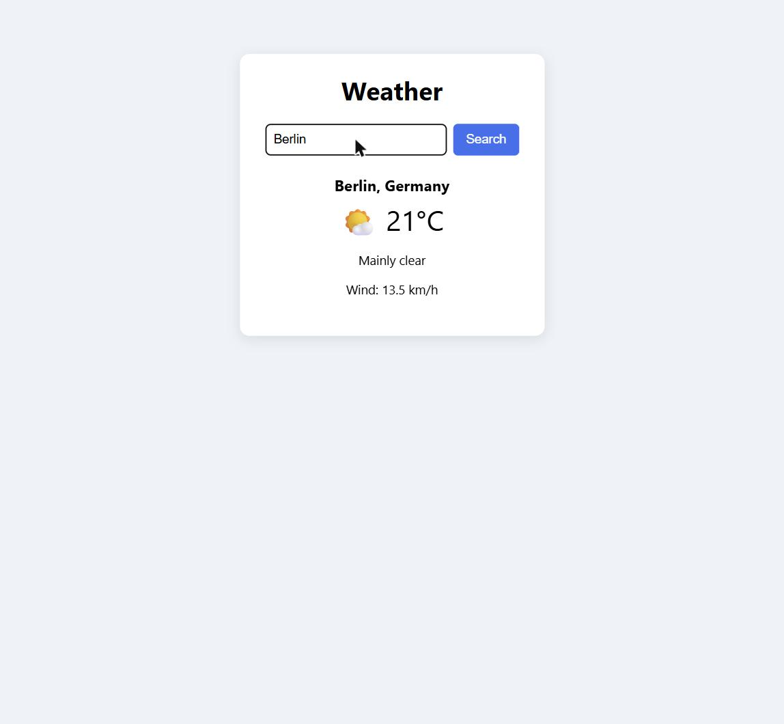
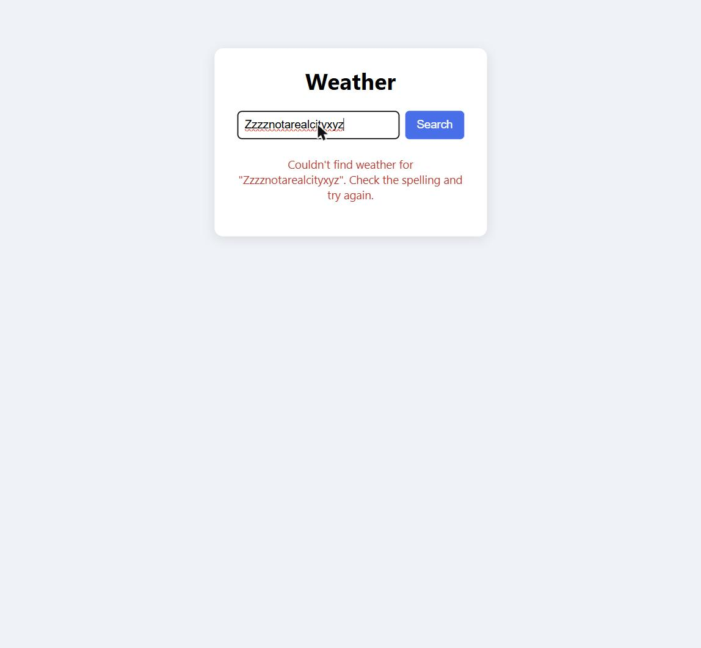

🇩🇪 Deutsch | 🇬🇧 [English](../en/01-weather-app.md)

[← Zurück zur Kursübersicht](../../../README.de.md) · Verwandt: [Kurs 4 – To-Do-Liste](../../04-todo-list/de/01-to-do-liste.md), [Kurs 5 – Einheitenumrechner](../../05-unit-converter/de/01-einheitenumrechner.md), [Kurs 6 – Quiz](../../06-quiz/de/01-quiz.md), [Kurs 7 – Memory-Spiel](../../07-memory-game/de/01-memory-spiel.md) (keiner davon nötig — das DOM-Render-Muster weiter unten wird dir vertraut vorkommen, falls du einen davon gemacht hast)

# Kapitel 1 – Wetter-App

**Ziel:** eine kleine App bauen, die echtes, aktuelles Wetter für eine
beliebige eingetippte Stadt abruft — der erste Kurs, in dem dein Code mit
der Außenwelt spricht, statt nur mit Daten zu arbeiten, die du selbst
eingetippt hast. Dieser Kurs setzt nur
[Kurs 1 – Basics](../../01-basics/de/00-einleitung.md) voraus (Werte,
Variablen, Operatoren, Klammern, Funktionen, Bedingungen, Schleifen) und
sonst nichts; er steht vollständig für sich.

Die fertigen Referenzdateien liegen in
[`courses/08-weather-app/code/`](../code/): `index.html`, `style.css`,
`script.js`. `index.html` und `style.css` sind so, wie sie sind, direkt
einsatzbereit. `script.js` ist die eigentliche Übung: kopiere alle drei
Dateien in deinen eigenen Arbeitsordner, leere deine Kopie von
`script.js`, und bau sie Stück für Stück wieder auf. Wie in
[Kurs 5](../../05-unit-converter/de/01-einheitenumrechner.md),
[Kurs 6](../../06-quiz/de/01-quiz.md) und
[Kurs 7](../../07-memory-game/de/01-memory-spiel.md) bleibt der
kniffligste Teil dir überlassen, aus beschriebenen Schritten
zusammengesetzt, statt fertig geschrieben vorzuliegen.

In diesem Kapitel brauchst du nirgends eine Registrierung, ein Konto oder
einen API-Key — der hier genutzte Wetterdienst ist kostenlos und lässt
sich direkt aufrufen.

Hier ist das fertige Ergebnis, auf das du hinarbeitest:



## 🟢 Kern — Das Layout (HTML + CSS)

```html
<div class="app">
  <h1>Weather</h1>

  <form id="search-form">
    <input type="text" id="city-input" placeholder="Enter a city..." autocomplete="off" />
    <button type="submit">Search</button>
  </form>

  <div id="result"></div>
</div>
```

`#result` startet leer — JavaScript füllt es, sobald du nach einer Stadt
gesucht hast, derselbe "Container in HTML leer lassen, aus JavaScript
füllen"-Ansatz wie bei jeder Liste oder jedem Raster in früheren Kursen.
Die vollständige Version steht in [`index.html`](../code/index.html) und
[`style.css`](../code/style.css); das CSS ist ein einfaches Karten-Layout,
nichts Neues.

Ab hier geht alles in `script.js` — das ist die Datei, die `index.html`
tatsächlich lädt. Starte mit:

```js
const searchForm = document.getElementById("search-form");
const cityInput = document.getElementById("city-input");
const result = document.getElementById("result");
```

## 🟢 Kern — Das DOM, kurz erklärt

*(Falls du Kurs 3, 4, 5, 6 oder 7 gemacht hast, ist dir das alles schon
vertraut — spring direkt zum nächsten Abschnitt.)*

JavaScript sieht deine HTML-Tags nicht direkt — es sieht das **DOM**
(Document Object Model), die lebendige, speicherinterne Darstellung der
Seite im Browser. Dieses Kapitel braucht:

- [`document.getElementById(...)`](https://developer.mozilla.org/de/docs/Web/API/Document/getElementById)
  findet ein Element anhand seiner `id`.
- [`addEventListener("submit", ...)`](https://developer.mozilla.org/de/docs/Web/API/EventTarget/addEventListener)
  bedeutet "führe diese Funktion aus, wann immer dieses Formular abgeschickt
  wird" — das passiert sowohl beim Klick auf den Button als auch beim
  Drücken von Enter im fokussierten Eingabefeld, beides auf einmal. Die
  Funktion, die du übergibst (`(event) => { ... }`), ist eine
  [Arrow-Funktion](https://developer.mozilla.org/de/docs/Web/JavaScript/Reference/Functions/Arrow_functions) —
  eine kürzere Schreibweise für eine kleine Funktion, besonders wenn du
  sie nur einmal, genau hier, brauchst.
- [`event.preventDefault()`](https://developer.mozilla.org/de/docs/Web/API/Event/preventDefault)
  stoppt das Standardverhalten eines Formulars, das sonst die ganze Seite
  neu lädt — ohne diese Zeile würde jede Suche den Browser neu laden und
  das Ergebnis sofort wieder verlieren.
- `.value` liest den Text, der gerade in ein `<input>` eingetippt ist.
- `.innerHTML` ersetzt alles innerhalb eines Elements durch neues HTML,
  genau wie die Render-Funktionen früherer Kurse.

## 🟢 Kern — Mit einem Server sprechen: fetch, Promises und async/await

Jeder Kurs bis hierhin hat nur mit Daten gearbeitet, die du selbst in den
Code eingetippt hast. Dieser hier fragt einen anderen Computer irgendwo im
Internet nach Daten — und das braucht Zeit: die Anfrage muss dorthin
reisen, beantwortet werden, und zurückreisen. JavaScript kann nicht
einfach pausieren und warten, denn ein pausierter Browser-Tab würde
komplett einfrieren. Stattdessen bekommst du ein **Promise** zurück: einen
Platzhalter für einen Wert, den es noch nicht gibt, der aber kommen wird
(oder einen Fehler, falls etwas schiefgeht).

[`fetch(url)`](https://developer.mozilla.org/de/docs/Web/API/Window/fetch)
startet eine Netzwerkanfrage und gibt ein Promise für die Antwort zurück.
Der sauberste Weg, mit diesem Promise zu arbeiten, ist
[`await`](https://developer.mozilla.org/de/docs/Web/JavaScript/Reference/Operators/await):
es pausiert *nur diese eine Funktion* (nie die ganze Seite), bis das
Promise abgeschlossen ist, und gibt dir dann den eigentlichen Wert
direkt, als wäre er schon die ganze Zeit da gewesen. `await` funktioniert
nur innerhalb einer mit
[`async`](https://developer.mozilla.org/de/docs/Web/JavaScript/Reference/Statements/async_function)
markierten Funktion:

```js
async function greetSlowly() {
  console.log("Waiting...");
  await new Promise((resolve) => setTimeout(resolve, 1000));
  console.log("One second has passed.");
}

greetSlowly();
console.log("This logs immediately, before the function above finishes.");
```

Das gibt "Waiting...", dann sofort "This logs immediately..." aus, und
etwa eine Sekunde später "One second has passed." — der Rest des Codes
auf der Seite läuft weiter, während `greetSlowly` bei seinem `await`
pausiert ist, dieselbe "blockiert nichts anderes"-Idee wie bei
`setTimeout` in [Kurs 7](../../07-memory-game/de/01-memory-spiel.md).

Ein echter `fetch`-Aufruf braucht zwei `await`s: eines, bis die Antwort
ankommt, und ein zweites, um ihren Inhalt als JSON zu lesen (was selbst
wieder asynchron ist, da der Inhalt noch nachladen kann):

```js
async function getJoke() {
  const response = await fetch("https://official-joke-api.appspot.com/random_joke");
  const data = await response.json();
  console.log(data);
}

getJoke();
```

Führ das in einer Konsole aus, und du siehst ein ganz normales
JavaScript-Objekt ausgegeben — `fetch` und `.json()` haben die rohen
Netzwerk-Bytes bereits in etwas verwandelt, von dem du `.setup` und
`.punchline` direkt auslesen kannst.

## 🟢 Kern — Von einem Stadtnamen zu Koordinaten

Der Wetterdienst dieses Kapitels, [Open-Meteo](https://open-meteo.com/),
ist eigentlich zwei getrennte APIs: eine, die einen Ortsnamen in
Koordinaten umwandelt (**Geocoding**), und eine, die aus Koordinaten eine
Vorhersage macht. Hier ist die erste, fertig geschrieben — ein
durchgerechnetes Beispiel für das Muster, das du im nächsten Abschnitt
selbst wiederverwendest:

```js
async function getCoordinates(city) {
  const url = "https://geocoding-api.open-meteo.com/v1/search?name=" + encodeURIComponent(city) + "&count=1&language=en&format=json";
  const response = await fetch(url);
  const data = await response.json();

  if (!data.results || data.results.length === 0) {
    throw new Error("City not found: " + city);
  }

  const place = data.results[0];
  return { latitude: place.latitude, longitude: place.longitude, name: place.name, country: place.country };
}
```

Ein paar Dinge, die auffallen sollten:

- [`encodeURIComponent(...)`](https://developer.mozilla.org/de/docs/Web/JavaScript/Reference/Global_Objects/encodeURIComponent)
  macht eine Zeichenkette sicher für den Einbau in eine URL — es wandelt
  Leerzeichen und andere Sonderzeichen in die `%20`-artigen Escapes um,
  die eine URL braucht. Pack eingetippten Nutzertext immer erst hierdurch,
  bevor du ihn von Hand in eine URL einfügst.
- Die API antwortet immer mit einem `results`-**Array**, sogar bei genau
  einem Treffer — fragst du nach einer Stadt, die es nicht gibt, kommt ein
  leeres Array (`[]`) zurück, kein Fehler. Deshalb prüft `getCoordinates`
  selbst die Länge und
  [`throw`](https://developer.mozilla.org/de/docs/Web/JavaScript/Reference/Statements/throw)t
  einen eigenen Fehler, wenn nichts zurückkam — mehr zu `throw` und dem
  Auffangen weiter unten.
- Die Funktion gibt ein einfaches Objekt mit nur den vier Feldern zurück,
  die der Rest der App tatsächlich braucht, statt des viel größeren
  Objekts, das die API geschickt hat — Daten in die Form umzubauen, die du
  brauchst, ist normal und lohnt sich früh.

Probier es aus: füg diese Funktion in eine Konsole ein (egal auf welcher
Seite — sie ist nicht an dein `index.html` gebunden), dann führ
`getCoordinates("Tokyo").then(console.log)` aus und schau, was
zurückkommt.

## 🟢 Kern — Von Koordinaten zu einer Vorhersage

Jetzt der zweite API-Aufruf — den schreibst du selbst, nach genau demselben
Muster wie `getCoordinates` oben. `getCurrentWeather(latitude, longitude)`
soll:

1. Diese URL bauen (mit den echten `latitude`/`longitude`-Werten
   eingesetzt): `https://api.open-meteo.com/v1/forecast?latitude=LAT&longitude=LON&current=temperature_2m,weather_code,wind_speed_10m&timezone=auto`
2. Diese URL mit `await` und `fetch` abrufen, dann `await` auf ihre
   `.json()`.
3. Die `.current`-Eigenschaft der eingelesenen Daten zurückgeben — das ist
   ein Objekt in der Form `{ temperature_2m: 18.4, weather_code: 3,
   wind_speed_10m: 11.2, ... }`.

```js
async function getCurrentWeather(latitude, longitude) {
  // dein Code hier — die drei Schritte oben
}
```

Eine Koordinaten-Suche brauchst du hier nicht — die Vorhersage-API nimmt
Breiten- und Längengrad direkt entgegen, genau das, was dir
`getCoordinates` schon geliefert hat.

## 🟢 Kern — Lade-, Fehler- und Ergebniszustand rendern

Das hier bekommst du fertig — reines DOM-Rendering, dasselbe
`innerHTML`-aus-Daten-Muster wie in früheren Kursen, nicht der Punkt
dieses Kapitels:

```js
const weatherCodes = {
  0: { text: "Clear sky", icon: "☀️" },
  1: { text: "Mainly clear", icon: "🌤️" },
  2: { text: "Partly cloudy", icon: "⛅" },
  3: { text: "Overcast", icon: "☁️" },
  45: { text: "Fog", icon: "🌫️" },
  48: { text: "Depositing rime fog", icon: "🌫️" },
  51: { text: "Light drizzle", icon: "🌦️" },
  53: { text: "Moderate drizzle", icon: "🌦️" },
  55: { text: "Dense drizzle", icon: "🌧️" },
  61: { text: "Slight rain", icon: "🌧️" },
  63: { text: "Moderate rain", icon: "🌧️" },
  65: { text: "Heavy rain", icon: "🌧️" },
  71: { text: "Slight snowfall", icon: "🌨️" },
  73: { text: "Moderate snowfall", icon: "🌨️" },
  75: { text: "Heavy snowfall", icon: "❄️" },
  80: { text: "Rain showers", icon: "🌦️" },
  81: { text: "Rain showers", icon: "🌧️" },
  82: { text: "Violent rain showers", icon: "⛈️" },
  95: { text: "Thunderstorm", icon: "⛈️" },
};

function describeWeatherCode(code) {
  return weatherCodes[code] || { text: "Unknown", icon: "❓" };
}

function renderLoading() {
  result.innerHTML = "<p>Loading...</p>";
}

function renderError(message) {
  result.innerHTML = '<p class="error">' + message + "</p>";
}

function renderWeather(place, weather) {
  const info = describeWeatherCode(weather.weather_code);
  result.innerHTML =
    '<div class="weather-card">' +
      "<h2>" + place.name + ", " + place.country + "</h2>" +
      '<p class="temperature">' + info.icon + " " + Math.round(weather.temperature_2m) + "°C</p>" +
      "<p>" + info.text + "</p>" +
      "<p>Wind: " + weather.wind_speed_10m + " km/h</p>" +
    "</div>";
}
```

`weatherCodes` ist das **Nachschlagetabellen-Muster** aus
[Kurs 5](../../05-unit-converter/de/01-einheitenumrechner.md): die API
liefert dir nur einen numerischen `weather_code`, und diese Tabelle
verwandelt ihn in Text und ein Emoji, das ein Mensch lesen kann.
[`Math.round(...)`](https://developer.mozilla.org/de/docs/Web/JavaScript/Reference/Global_Objects/Math/round)
rundet die Temperatur auf eine ganze Zahl, da die API Dezimalwerte wie
`18.4` liefert.

## 🟢 Kern — Fehler behandeln und alles zusammenfügen

Netzwerkanfragen scheitern — ein Tippfehler in der Stadt, keine
Internetverbindung, die API ist gerade down.
[`try...catch`](https://developer.mozilla.org/de/docs/Web/JavaScript/Reference/Statements/try...catch)
lässt dich etwas Riskantes versuchen und dich davon erholen, statt
abzustürzen:

```js
try {
  const place = await getCoordinates("Nowhereville12345");
  console.log(place);
} catch (error) {
  console.log("Something went wrong:", error.message);
}
```

Was auch immer der Code innerhalb von `try { ... }` wirft — inklusive
`getCoordinates`s eigenem `throw new Error(...)` für eine Stadt ohne
Treffer, und jedes Netzwerkproblem, auf das `fetch` selbst stößt —
springt direkt zu `catch (error) { ... }`, statt das ganze Programm zu
stoppen.

Schreib jetzt `handleSearch(event)`, die Funktion, die das `"submit"`-
Ereignis des Formulars aufruft. Sie muss:

1. `event.preventDefault()` aufrufen (siehe DOM-Übersicht oben).
2. Die eingetippte Stadt aus `cityInput.value` lesen und mit
   [`.trim()`](https://developer.mozilla.org/de/docs/Web/JavaScript/Reference/Global_Objects/String/trim)
   trimmen. Ist danach nichts mehr übrig, `return` — es gibt nichts zu
   suchen.
3. `renderLoading()` aufrufen, damit die Nutzerin oder der Nutzer
   *irgendetwas* sieht, während die Anfragen unterwegs sind.
4. Innerhalb eines `try`-Blocks: `await getCoordinates(city)`, dann
   `await getCurrentWeather(...)` mit den Koordinaten dieses Ortes, dann
   `renderWeather(place, weather)`.
5. Im `catch`-Block: `renderError(...)` mit einer freundlichen Meldung
   aufrufen, die die gesuchte Stadt nennt.

```js
async function handleSearch(event) {
  // dein Code hier — die fünf Schritte oben
}

searchForm.addEventListener("submit", handleSearch);
```

Speichern, `index.html` neu laden, und nach einer echten Stadt suchen —
du solltest kurz eine Lademeldung aufblitzen sehen, dann die aktuelle
Temperatur, die Bedingungen und die Windgeschwindigkeit. Such nach etwas,
das gar keine Stadt ist, und du solltest die Fehlermeldung statt einer
kaputten Seite sehen. Falls du nicht weiterkommst,
[`code/script.js`](../code/script.js) zeigt einen Weg, wie man beide
Funktionen schreiben kann.

## 🟡 Optional — Die letzte Suche merken

Nutz [`localStorage`](https://developer.mozilla.org/de/docs/Web/API/Window/localStorage)
(denselben dauerhaften Schlüssel-Wert-Speicher des Browsers aus
[Kurs 4](../../04-todo-list/de/01-to-do-liste.md)), um bei jedem
erfolgreichen `handleSearch` die zuletzt gesuchte Stadt zu speichern, und
beim Laden der Seite, falls schon eine Stadt gespeichert ist, trag sie
direkt in `cityInput.value` ein und führ die Suche sofort aus — damit das
erneute Öffnen der App dieselbe Stadt zeigt, ohne dass du sie nochmal
eintippen musst.

## 🔴 Optional, echte Herausforderung — Eine kurze Vorhersage

Der Vorhersage-Endpunkt von Open-Meteo kann mehr als nur die aktuellen
Bedingungen liefern. Füg `&daily=temperature_2m_max,temperature_2m_min,weather_code`
zur Vorhersage-URL hinzu (zusätzlich zum bestehenden `current=...`-
Parameter), und die Antwort bekommt ein `.daily`-Objekt in der Form
`{ time: ["2026-08-25", "2026-08-26", ...], temperature_2m_max: [23.1,
21.7, ...], temperature_2m_min: [14.2, 13.9, ...], weather_code: [1, 61,
...] }` — ein Array pro Feld, alle gleich lang, ein Eintrag pro Tag.
Schreib eine Funktion `renderForecast(daily)`, die eine kleine Karte pro
Tag baut (heute überspringen, `.slice(1)` für ab morgen) und dabei
Datum, Icon und Höchst-/Tiefsttemperatur zeigt, mit
[`.map(...)`](https://developer.mozilla.org/de/docs/Web/JavaScript/Reference/Global_Objects/Array/map)
über `daily.time` — du brauchst denselben Index in jedes der parallelen
Arrays für jeden Tag.

## Probier es selbst aus

Such nach einer echten Stadt und sieh ihr aktuelles Wetter:



Such nach etwas, das kein echter Ort ist:



Öffne [`courses/08-weather-app/code/index.html`](../code/index.html) in
deinem Browser. Anders als frühere Kurse braucht dieser eine
Internetverbindung — er spricht tatsächlich mit einem Server.

## Checkpoint & was du gelernt hast

- Promises, `async`/`await`, und warum Netzwerkanfragen nicht einfach die
  ganze Seite "pausieren" können
- `fetch(...)` zusammen mit `.json()`, um eine echte, öffentliche API
  aufzurufen und ihre Antwort zu lesen
- `encodeURIComponent(...)`, um aus Nutzereingaben sicher eine URL zu
  bauen
- `try...catch` und `throw new Error(...)`, um mit Fehlern umzugehen,
  ohne abzustürzen
- Die Antwort einer API in genau die Felder umbauen, die deine App
  wirklich braucht
- Das Nachschlagetabellen-Muster nochmal, diesmal um die numerischen
  Codes einer API in lesbaren Text zu verwandeln

## Was als Nächstes kommt

Dieser Kurs steht für sich. Für eine größere Auswahl, was als Nächstes zu
bauen wäre, siehe [PROJECT-IDEAS.de.md](../../../PROJECT-IDEAS.de.md).
