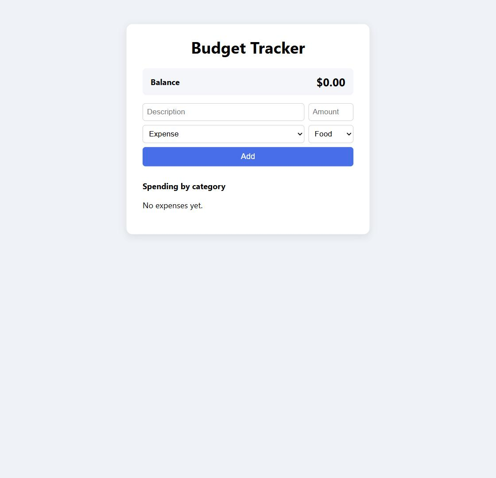
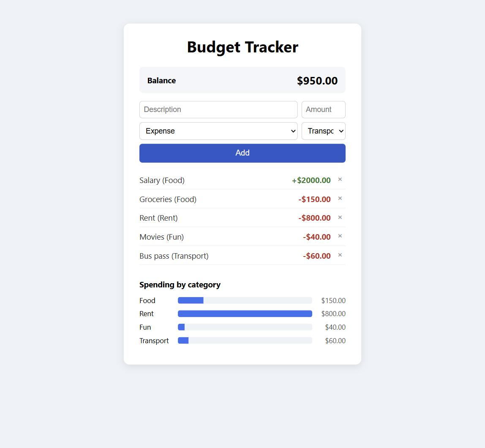

🇩🇪 Deutsch | 🇬🇧 [English](../en/01-budget-tracker.md)

[← Zurück zur Kursübersicht](../../../README.de.md) · Verwandt: [Kurs 4 – To-Do-Liste](../../04-todo-list/de/01-to-do-liste.md), [Kurs 8 – Wetter-App](../../08-weather-app/de/01-wetter-app.md) (keiner davon nötig — das Speicher-Muster unten nutzt denselben Ansatz wie Kurs 4, von Grund auf neu gebaut)

# Kapitel 1 – Budget-Tracker

**Ziel:** eine kleine App bauen, die Einnahmen und Ausgaben erfasst, deinen
aktuellen Kontostand zeigt, und Ausgaben nach Kategorie mit einem
einfachen Balkendiagramm aufschlüsselt — komplett aus Array-Methoden
gebaut, ganz ohne Diagramm-Bibliothek. Dieser Kurs setzt nur
[Kurs 1 – Basics](../../01-basics/de/00-einleitung.md) voraus (Werte,
Variablen, Operatoren, Klammern, Funktionen, Bedingungen, Schleifen) und
sonst nichts; er steht vollständig für sich.

Die fertigen Referenzdateien liegen in
[`courses/09-budget-tracker/code/`](../code/): `index.html`, `style.css`,
`script.js`. `index.html` und `style.css` sind so, wie sie sind, direkt
einsatzbereit. `script.js` ist die eigentliche Übung: kopiere alle drei
Dateien in deinen eigenen Arbeitsordner, leere deine Kopie von
`script.js`, und bau sie Stück für Stück wieder auf. Wie in
[Kurs 5](../../05-unit-converter/de/01-einheitenumrechner.md),
[Kurs 6](../../06-quiz/de/01-quiz.md), [Kurs 7](../../07-memory-game/de/01-memory-spiel.md)
und [Kurs 8](../../08-weather-app/de/01-wetter-app.md) bleiben die
kniffligsten Teile dir überlassen, aus beschriebenen Schritten
zusammengesetzt, statt fertig geschrieben vorzuliegen.

Hier ist das fertige Ergebnis, auf das du hinarbeitest:



## 🟢 Kern — Das Layout (HTML + CSS)

```html
<div class="app">
  <h1>Budget Tracker</h1>

  <div id="summary">
    <span>Balance</span>
    <span id="balance">$0.00</span>
  </div>

  <form id="entry-form">
    <input type="text" id="description-input" placeholder="Description" autocomplete="off" required />
    <input type="number" id="amount-input" placeholder="Amount" step="0.01" min="0" required />
    <select id="type-input">
      <option value="expense">Expense</option>
      <option value="income">Income</option>
    </select>
    <select id="category-input">
      <option value="Food">Food</option>
      <option value="Rent">Rent</option>
      <option value="Transport">Transport</option>
      <option value="Fun">Fun</option>
      <option value="Other">Other</option>
    </select>
    <button type="submit">Add</button>
  </form>

  <ul id="entry-list"></ul>

  <h2>Spending by category</h2>
  <div id="chart"></div>
</div>
```

`#entry-list` und `#chart` starten leer — JavaScript füllt beide aus
denselben zugrunde liegenden Daten, derselbe "Container in HTML leer
lassen, aus JavaScript füllen"-Ansatz wie bei jeder Liste oder jedem
Raster in früheren Kursen. Die vollständige Version steht in
[`index.html`](../code/index.html) und [`style.css`](../code/style.css);
das CSS ist ein einfaches Karten-Layout, nichts Neues.

Ab hier geht alles in `script.js` — das ist die Datei, die `index.html`
tatsächlich lädt. Starte mit:

```js
const STORAGE_KEY = "budget-tracker-entries";

const balanceText = document.getElementById("balance");
const entryForm = document.getElementById("entry-form");
const descriptionInput = document.getElementById("description-input");
const amountInput = document.getElementById("amount-input");
const typeInput = document.getElementById("type-input");
const categoryInput = document.getElementById("category-input");
const entryList = document.getElementById("entry-list");
const chart = document.getElementById("chart");
```

## 🟢 Kern — Das DOM und der Speicher, kurz erklärt

*(Falls du Kurs 3, 4, 5, 6, 7 oder 8 gemacht hast, ist dir das meiste
schon vertraut — spring direkt zum nächsten Abschnitt.)*

- [`document.getElementById(...)`](https://developer.mozilla.org/de/docs/Web/API/Document/getElementById)
  findet ein Element anhand seiner `id`.
- [`addEventListener("submit", ...)`](https://developer.mozilla.org/de/docs/Web/API/EventTarget/addEventListener)
  zusammen mit [`event.preventDefault()`](https://developer.mozilla.org/de/docs/Web/API/Event/preventDefault)
  (siehe [Kurs 8](../../08-weather-app/de/01-wetter-app.md), falls dir das
  neu ist) verarbeitet das "Add"-Formular, ohne die Seite neu zu laden.
- `.value` liest, was gerade in ein `<input>` eingetippt oder in einem
  `<select>` ausgewählt ist;
  [`Number(...)`](https://developer.mozilla.org/de/docs/Web/JavaScript/Reference/Global_Objects/Number)
  wandelt den Text des Betragsfelds in eine echte Zahl um, mit der man
  rechnen kann.
- `.innerHTML` ersetzt alles innerhalb eines Elements durch neues HTML,
  und [`.map(...)`](https://developer.mozilla.org/de/docs/Web/JavaScript/Reference/Global_Objects/Array/map),
  das pro Element eine HTML-Zeichenkette baut, gefolgt von
  [`.join("")`](https://developer.mozilla.org/de/docs/Web/JavaScript/Reference/Global_Objects/Array/join),
  um sie zusammenzukleben, ist genau das Render-Muster, das
  [Kurs 4](../../04-todo-list/de/01-to-do-liste.md) eingeführt hat.
- [`localStorage`](https://developer.mozilla.org/de/docs/Web/API/Window/localStorage)
  ist der dauerhafte Schlüssel-Wert-Speicher des Browsers — Daten, die dort
  gespeichert werden, überstehen das Schließen des Tabs oder des ganzen
  Browsers. Er speichert nur Text, also braucht das Speichern von allem
  anderen [`JSON.stringify(...)`](https://developer.mozilla.org/de/docs/Web/JavaScript/Reference/Global_Objects/JSON/stringify)
  auf dem Hinweg und
  [`JSON.parse(...)`](https://developer.mozilla.org/de/docs/Web/JavaScript/Reference/Global_Objects/JSON/parse)
  auf dem Rückweg — derselbe Umweg, den Kurs 4 für seine Aufgaben genutzt
  hat.

Diese zwei bekommst du fertig, unverändert aus demselben Kurs-4-Muster:

```js
function loadEntries() {
  const saved = localStorage.getItem(STORAGE_KEY);
  return saved ? JSON.parse(saved) : [];
}

function saveEntries() {
  localStorage.setItem(STORAGE_KEY, JSON.stringify(entries));
}

let entries = loadEntries();
```

Jeder Eintrag ist ein einfaches Objekt: `{ description: "Groceries",
amount: 150, type: "expense", category: "Food" }` — das
Objektliteral-Muster aus früheren Kursen, ein Objekt pro Zeile, die du
später auf dem Bildschirm siehst.

## 🟢 Kern — Array-Methoden, die eine einzelne Antwort berechnen

Jede Render-Funktion bisher hat `.map(...)` benutzt: jedes Array-Element
in etwas umwandeln, dabei bleibt die Anzahl der Elemente gleich. Dieses
Kapitel braucht zwei andere Formen:

**[`.filter(...)`](https://developer.mozilla.org/de/docs/Web/JavaScript/Reference/Global_Objects/Array/filter)**
behält nur die Elemente, die eine Funktion durchlässt, und wirft den Rest
weg — das Ergebnis ist ein kürzeres Array (oder ein gleich langes, oder
ein leeres), nie eine umgewandelte Version jedes Elements:

```js
const numbers = [1, 2, 3, 4, 5, 6];
const even = numbers.filter((n) => n % 2 === 0);
console.log(even); // [2, 4, 6]
```

**[`.reduce(...)`](https://developer.mozilla.org/de/docs/Web/JavaScript/Reference/Global_Objects/Array/reduce)**
geht ein Array durch und verdichtet es auf einen einzigen Wert — eine
Summe, eine Anzahl, ein Maximum, was auch immer. Es nimmt eine Funktion,
die die "bisherige Zwischensumme" und das aktuelle Element bekommt, sowie
einen Startwert:

```js
const prices = [10, 25, 5];
const total = prices.reduce((sum, price) => sum + price, 0);
console.log(total); // 40
```

Lies das so: "starte `sum` bei `0`; ersetze für jeden `price` `sum` durch
`sum + price`; sobald jedes Element besucht wurde, ist `total` das, was
aus `sum` geworden ist." Die `0` ist der Startwert — tausch sie gegen
etwas anderes aus, und `.reduce(...)` kann statt einer Summe ein Maximum
berechnen, wie du weiter unten siehst.

## 🟢 Kern — Der Kontostand, mit reduce

Hier berechnet `.reduce(...)` etwas Echtes: den aktuellen Kontostand,
Einnahmen minus Ausgaben, in einem einzigen Durchlauf über `entries`:

```js
function calculateBalance() {
  return entries.reduce((total, entry) => {
    if (entry.type === "income") {
      return total + entry.amount;
    }
    return total - entry.amount;
  }, 0);
}
```

`total` startet bei `0`. Für jeden Eintrag gibt die Funktion entweder
`total + entry.amount` zurück (eine Einnahme lässt den Kontostand steigen)
oder `total - entry.amount` (eine Ausgabe lässt ihn sinken) — was auch
immer zurückgegeben wird, wird zum `total`, das in den nächsten Eintrag
einfließt. Nach dem letzten gibt `.reduce(...)` genau dieses finale
`total` direkt zurück.

## 🟢 Kern — Ausgaben pro Kategorie, mit filter

Jetzt bist du dran, mit `.filter(...)` von oben.
`calculateCategoryTotals()` soll ein einfaches Objekt in der Form
`{ Food: 150, Rent: 800, Fun: 40 }` bauen und zurückgeben — ein Schlüssel
pro Kategorie mit mindestens einer Ausgabe, zugeordnet zur Summe der
Ausgaben dieser Kategorie. Schritte:

1. Nur die Ausgaben-Einträge holen: `entries.filter((entry) => entry.type
   === "expense")`.
2. Ein leeres Objekt starten: `const totals = {};`
3. Über die gefilterten Ausgaben mit
   [`.forEach(...)`](https://developer.mozilla.org/de/docs/Web/JavaScript/Reference/Global_Objects/Array/forEach)
   iterieren. Für jede addiere ihren Betrag in `totals` unter dem
   Schlüssel ihrer Kategorie: `totals[entry.category] =
   (totals[entry.category] || 0) + entry.amount;` — das `|| 0` ist hier
   wichtig, denn `totals[entry.category]` ist beim ersten Auftauchen
   einer Kategorie `undefined` (nicht `0`), und `undefined +
   entry.amount` wäre `NaN`.
4. `totals` zurückgeben.

```js
function calculateCategoryTotals() {
  // dein Code hier — die vier Schritte oben
}
```

## 🟢 Kern — Einen Eintrag hinzufügen

`handleAddEntry(event)` läuft, wenn das Formular abgeschickt wird. Sie
muss:

1. `event.preventDefault()` aufrufen.
2. `descriptionInput.value` lesen und mit
   [`.trim()`](https://developer.mozilla.org/de/docs/Web/JavaScript/Reference/Global_Objects/String/trim)
   trimmen, und `Number(amountInput.value)` lesen. Ist die Beschreibung
   leer, oder ist der Betrag keine positive Zahl (`!(amount > 0)` fängt
   `0`, negative Zahlen und `NaN` aus einem leeren Feld alle auf einmal
   ab), `return` — es gibt nichts hinzuzufügen.
3. Ein neues Eintrags-Objekt auf `entries` pushen: `{ description:
   description, amount: amount, type: typeInput.value, category:
   categoryInput.value }`.
4. Die beiden Text-/Zahlenfelder zurück auf `""` setzen, damit das
   Formular für den nächsten Eintrag bereit ist.
5. `saveEntries()` aufrufen, dann `renderAll()` (unten fertig
   geschrieben).

```js
function handleAddEntry(event) {
  // dein Code hier — die fünf Schritte oben
}

entryForm.addEventListener("submit", handleAddEntry);
```

Speichern, `index.html` neu laden, und einen Eintrag hinzufügen — er
sollte in der Liste erscheinen und der Kontostand sich aktualisieren.
Falls du nicht weiterkommst, [`code/script.js`](../code/script.js) zeigt
einen Weg, wie man beide Funktionen schreiben kann.

## 🟢 Kern — Alles rendern

Das hier bekommst du fertig — reines DOM-Rendering, aufgebaut auf den
Funktionen oben, nicht der Punkt dieses Kapitels:

```js
function formatAmount(amount) {
  return "$" + amount.toFixed(2);
}

function renderBalance() {
  balanceText.textContent = formatAmount(calculateBalance());
}

function renderEntries() {
  entryList.innerHTML = entries
    .map((entry, index) => {
      const sign = entry.type === "income" ? "+" : "-";
      const amountClass = entry.type === "income" ? "amount income" : "amount expense";
      return (
        '<li class="entry">' +
          '<span class="description">' + entry.description + " (" + entry.category + ")</span>" +
          '<span class="' + amountClass + '">' + sign + formatAmount(entry.amount) + "</span>" +
          '<button class="remove" data-index="' + index + '">&times;</button>' +
        "</li>"
      );
    })
    .join("");

  entryList.querySelectorAll(".remove").forEach((button) => {
    button.addEventListener("click", () => {
      const index = Number(button.dataset.index);
      entries.splice(index, 1);
      saveEntries();
      renderAll();
    });
  });
}

function renderChart() {
  const totals = calculateCategoryTotals();
  const categories = Object.keys(totals);

  if (categories.length === 0) {
    chart.innerHTML = "<p>No expenses yet.</p>";
    return;
  }

  const highest = categories.reduce((max, category) => {
    return totals[category] > max ? totals[category] : max;
  }, 0);

  chart.innerHTML = categories
    .map((category) => {
      const amount = totals[category];
      const percent = Math.round((amount / highest) * 100);
      return (
        '<div class="bar-row">' +
          '<span class="bar-label">' + category + "</span>" +
          '<div class="bar-track"><div class="bar-fill" style="width: ' + percent + '%"></div></div>' +
          '<span class="bar-amount">' + formatAmount(amount) + "</span>" +
        "</div>"
      );
    })
    .join("");
}

function renderAll() {
  renderBalance();
  renderEntries();
  renderChart();
}

renderAll();
```

Zwei Dinge, die auffallen sollten:

- [`.toFixed(2)`](https://developer.mozilla.org/de/docs/Web/JavaScript/Reference/Global_Objects/Number/toFixed)
  rundet eine Zahl auf 2 Nachkommastellen und gibt sie als Zeichenkette
  zurück, sodass `150` als `$150.00` erscheint, nicht als `$150` —
  dieselbe Methode, die schon [Kurs 5](../../05-unit-converter/de/01-einheitenumrechner.md)
  genutzt hat.
- Das "Diagramm" ist reines CSS: `.bar-track` ist ein grauer Streifen
  fester Breite, `.bar-fill` darin bekommt einen `width`-Prozentwert
  direkt aus JavaScript gesetzt (`style="width: 65%"`), so skaliert, dass
  die Kategorie mit den höchsten Ausgaben den Streifen komplett füllt
  (`percent = amount / highest * 100`) und jeder andere Balken
  proportional kürzer ist. Keine Diagramm-Bibliothek nötig — `.reduce(...)`,
  das die höchste Summe findet, macht diese Skalierung erst möglich.
- [`Object.keys(...)`](https://developer.mozilla.org/de/docs/Web/JavaScript/Reference/Global_Objects/Object/keys)
  verwandelt die Schlüssel eines Objekts in ein einfaches Array
  (`{ Food: 150, Rent: 800 }` → `["Food", "Rent"]`) — hier genutzt, damit
  `.map(...)` und `.reduce(...)`, die nur auf Arrays funktionieren, über
  die Kategorien von `totals` laufen können.

## 🟡 Optional — Die Liste nach Typ filtern

Füg zwei Buttons ("Show income" / "Show expenses") über der Eintragsliste
hinzu, dazu eine "Show all"-Option (das, was aktuell passiert). Merk dir
den aktuellen Filter in einer Variable (z. B. `let currentFilter =
"all";`), und bau die Liste in `renderEntries()` aus `entries.filter(
(entry) => currentFilter === "all" || entry.type === currentFilter)`
statt direkt aus `entries`. Verdrahte den Klick jedes Buttons so, dass er
`currentFilter` setzt und `renderAll()` erneut aufruft.

## 🔴 Optional, echte Herausforderung — Nach Betrag sortieren

Füg einen "Sort by amount"-Button hinzu, der die Eintragsliste vom
größten zum kleinsten Betrag umsortiert.
[`.sort(...)`](https://developer.mozilla.org/de/docs/Web/JavaScript/Reference/Global_Objects/Array/sort)
sortiert ein Array *direkt an Ort und Stelle*, mit einer
Vergleichsfunktion, die du übergibst: `entries.sort((a, b) => b.amount -
a.amount)`. Das Ergebnis dieser Vergleichsfunktion entscheidet über die
Reihenfolge: eine negative Zahl bedeutet, `a` kommt zuerst, eine positive
Zahl bedeutet, `b` kommt zuerst — `b.amount - a.amount` ist also immer
dann negativ, wenn `b` kleiner ist als `a`, was den größeren Betrag nach
vorne setzt, absteigende Reihenfolge. Da `.sort(...)` `entries` selbst
verändert (anders als `.map(...)`/`.filter(...)`, die immer ein neues
Array zurückgeben), ruf direkt nach dem Sortieren `saveEntries()` und
`renderAll()` erneut auf, damit die neue Reihenfolge gespeichert und
angezeigt wird. Vorsicht mit dem `data-index` des Entfernen-Buttons
danach: er ist weiterhin einfach "Position im aktuellen Array", bleibt
also korrekt, solange du nach jeder Änderung neu renderst — baust du aber
auch den 🟡-Filter oben, achte darauf, aus `entries` am richtigen Index zu
entfernen, nicht am Index der gefilterten Liste.

## Probier es selbst aus

Füg ein paar Einnahmen und Ausgaben hinzu und beobachte, wie sich
Kontostand und Diagramm aktualisieren:



Öffne [`courses/09-budget-tracker/code/index.html`](../code/index.html) in
deinem Browser — Doppelklick auf die Datei funktioniert problemlos, da
alles lokal läuft, ohne externe Anfragen.

## Checkpoint & was du gelernt hast

- `.filter(...)`, um nur die Array-Elemente zu behalten, die eine
  Bedingung erfüllen
- `.reduce(...)`, um ein Array auf einen Wert zu verdichten — eine Summe
  oder ein Maximum, dieselbe Methode, nur mit anderem Startwert und
  anderem Schritt
- `Object.keys(...)`, um die Schlüssel eines Objekts in ein Array zu
  verwandeln, über das man mit `.map(...)`/`.reduce(...)` laufen kann
- Ein reines CSS-Balkendiagramm: keine Bibliothek, nur ein
  `width`-Prozentwert, berechnet aus deinen Daten
- Kurs 4s `localStorage`-Speicher-Muster für eine zweite, stärker
  strukturierte Art von Daten wiederverwenden

## Was als Nächstes kommt

Dieser Kurs steht für sich. Für eine größere Auswahl, was als Nächstes zu
bauen wäre, siehe [PROJECT-IDEAS.de.md](../../../PROJECT-IDEAS.de.md).
