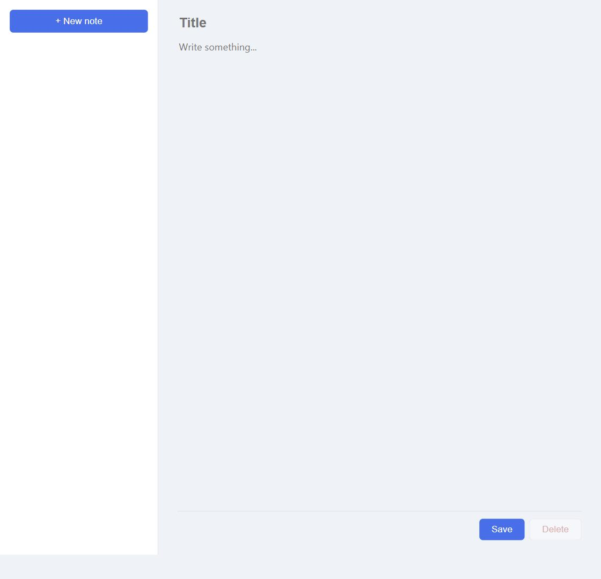
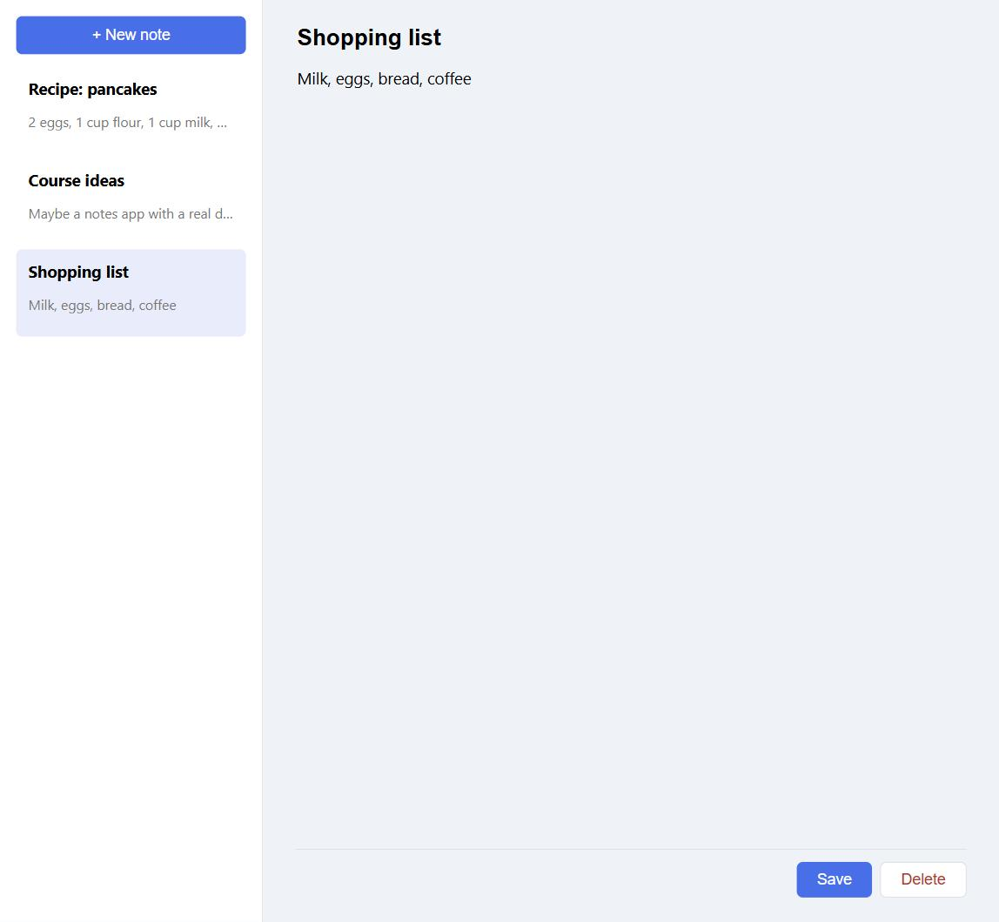

🇬🇧 English | 🇩🇪 [Deutsch](../de/01-notizen-app.md)

[← Back to course overview](../../../README.md) · Related: [Course 8 – Weather App](../../08-weather-app/en/01-weather-app.md), [Course 10 – REST API](../../10-rest-api/en/01-rest-api.md) (neither required — this course reuses both patterns: Course 8's `fetch` on the frontend, Course 10's Express routes on the backend, now talking to each other instead of the outside world)

# Chapter 1 – Full-Stack Notes App

**Goal:** build a notes app with a real, persistent database behind
it — your own frontend, in the same browser tab, talking to your own
backend, which stores every note in an actual SQLite database file
instead of memory or `localStorage`. This is the first course that
connects everything earlier courses built separately: a browser UI, a
server, and now real, permanent storage. This course assumes
[Course 1 – Basics](../../01-basics/en/00-introduction.md) only (values,
variables, operators, brackets, functions, conditionals, loops) and
nothing else; it stands entirely on its own, though it moves fast
through territory [Course 8](../../08-weather-app/en/01-weather-app.md)
and [Course 10](../../10-rest-api/en/01-rest-api.md) each covered slowly.

The finished reference files live in
[`courses/11-notes-app/code/`](../code/): `package.json`, `db.js`,
`server.js`, and a `public/` folder with `index.html`, `style.css`, and
`script.js`. `db.js` and the HTML/CSS are ready to use as they are.
`server.js` and `public/script.js` are the actual exercise: copy the
whole `code/` folder, install the dependency, empty out your copies of
those two files, and build them back up one piece at a time. As in
[Course 5](../../05-unit-converter/en/01-unit-converter.md) through
[Course 10](../../10-rest-api/en/01-rest-api.md), the trickiest parts are
left for you to assemble from described steps, not handed to you fully
written.

Like Course 10, this needs [Node.js](https://nodejs.org/) installed — if
you did that course already, you're set; otherwise see its "Before you
start" section.

## 🟢 Core — The shape of a full-stack app

One Express server does two jobs at once here: it answers API requests
(`/api/notes`, exactly like Course 10's `/tasks`) *and* it serves the
frontend's HTML/CSS/JS files as plain static files. Both come from the
same origin (`http://localhost:3000`), which sidesteps an entire problem
— [CORS](https://developer.mozilla.org/en-US/docs/Web/HTTP/CORS)
(Cross-Origin Resource Sharing), the browser's security rule that blocks
a page from freely calling an API on a different origin — that a
separately-hosted frontend and backend would otherwise force you to deal
with on day one. That's also why the frontend code lives in its own
`public/` folder: Express serves everything in that folder directly, at
the root URL, and nothing outside it.

## 🟢 Core — Project setup

Same shape as Course 10:

```json
{
  "name": "notes-app",
  "version": "1.0.0",
  "main": "server.js",
  "scripts": {
    "start": "node server.js"
  },
  "dependencies": {
    "express": "^5.2.1"
  }
}
```

```
npm install
```

## 🟢 Core — HTTP and Express, in short

*(If you've done [Course 10](../../10-rest-api/en/01-rest-api.md), skip
ahead — this is the same ground, faster.)*

An HTTP request has a **method** (`GET` reads, `POST` creates, `PATCH`
changes part of something, `DELETE` removes) and a **path** (`/api/notes`,
`/api/notes/3`). A response has a **status code** (`200` success, `201`
created, `204` success with nothing to send back, `400` the request was
invalid, `404` no such resource).
[Express](https://expressjs.com/) matches a method-plus-path pattern to a
handler function: `app.get("/api/notes/:id", (req, res) => { ... })`
runs whenever a `GET` request comes in for a path like `/api/notes/3`,
with `req.params.id` equal to `"3"`. `app.use(express.json())` parses a
JSON request body into `req.body`. `res.json(...)` sends a JSON response;
`res.status(...)` sets the status code first.

## 🟢 Core — A real database: SQLite

Every course so far that needed to remember something used either
`localStorage` (a browser feature, only for that one browser) or a plain
array in server memory (Course 10 — gone the moment the server
restarts). A **database** is neither: a real file on disk, built for
storing and querying structured data, that survives restarts and can
handle far more data than fits comfortably in memory.
[SQLite](https://www.sqlite.org/) stores an entire database as a single
file, and — unlike most databases — needs no separate server process
running. Even better: recent Node.js versions ship SQLite support
**built in**, so unlike Express, there's nothing to `npm install` for it
at all.

```js
const { DatabaseSync } = require("node:sqlite");

const db = new DatabaseSync("notes.db");

db.exec(`
  CREATE TABLE IF NOT EXISTS notes (
    id INTEGER PRIMARY KEY AUTOINCREMENT,
    title TEXT NOT NULL,
    content TEXT NOT NULL DEFAULT '',
    updated_at TEXT NOT NULL
  )
`);
```

`new DatabaseSync("notes.db")` opens that file (creating it if it doesn't
exist yet) — everything from here on reads from and writes to it
directly, on disk. [SQL](https://developer.mozilla.org/en-US/docs/Glossary/SQL)
(Structured Query Language) is its own small language for describing
data and questions about it, not JavaScript — `CREATE TABLE IF NOT
EXISTS notes (...)` describes a **table** named `notes`: rows of data,
each shaped the same way, one **column** per piece of information.
`id INTEGER PRIMARY KEY AUTOINCREMENT` is a number that uniquely
identifies each row and fills itself in automatically — the database
equivalent of Course 10's `crypto.randomUUID()`, just sequential integers
instead of random strings. `TEXT NOT NULL` means "required text";
`DEFAULT ''` gives `content` an empty string when none is provided.
`IF NOT EXISTS` means this is safe to run every time the server starts —
it only actually creates the table the first time.

The rest of `db.js` is given to you in full — SQL is new territory this
chapter, worth seeing completely worked out rather than reconstructed
from steps:

```js
function getAllNotes() {
  return db.prepare("SELECT * FROM notes ORDER BY updated_at DESC").all();
}

function getNote(id) {
  return db.prepare("SELECT * FROM notes WHERE id = ?").get(id);
}

function createNote(title, content) {
  const updatedAt = new Date().toISOString();
  const result = db
    .prepare("INSERT INTO notes (title, content, updated_at) VALUES (?, ?, ?)")
    .run(title, content, updatedAt);
  return getNote(result.lastInsertRowid);
}

function updateNote(id, title, content) {
  const updatedAt = new Date().toISOString();
  db.prepare("UPDATE notes SET title = ?, content = ?, updated_at = ? WHERE id = ?").run(
    title,
    content,
    updatedAt,
    id
  );
  return getNote(id);
}

function deleteNote(id) {
  db.prepare("DELETE FROM notes WHERE id = ?").run(id);
}

module.exports = { getAllNotes, getNote, createNote, updateNote, deleteNote };
```

Four SQL statements, one per job: `SELECT` reads rows (`*` means "every
column"; `ORDER BY updated_at DESC` sorts newest-edited-first — the same
idea as `.sort(...)` from
[Course 9](../../09-budget-tracker/en/01-budget-tracker.md), done by the
database instead of JavaScript), `INSERT` adds a row, `UPDATE` changes
one, `DELETE` removes one — both `UPDATE` and `DELETE` use `WHERE id = ?`
to target exactly one row, the same role `req.params.id` plays in
Course 10's routes. `db.prepare(sql)` compiles the SQL once;
`.get(...)`/`.all(...)`/`.run(...)` then execute it with real values
filled into each `?` **placeholder**, in order.

The placeholders matter for more than convenience: never build a SQL
string by gluing user input directly into it (`"SELECT * FROM notes
WHERE id = " + id`, say). A title or content field containing something
like `'; DROP TABLE notes; --` could then be interpreted as *more SQL*
instead of plain text — an attack called
[SQL injection](https://developer.mozilla.org/en-US/docs/Glossary/SQL_Injection).
Placeholders keep values as values, never as code, no matter what's
inside them — always use them for anything that came from a request.

## 🟢 Core — The API: reading notes

`server.js` starts like Course 10's, plus loading `db.js`:

```js
const express = require("express");
const path = require("path");
const notes = require("./db");

const app = express();
const PORT = 3000;

app.use(express.json());
app.use(express.static(path.join(__dirname, "public")));

app.get("/api/notes", (req, res) => {
  res.json(notes.getAllNotes());
});

app.get("/api/notes/:id", (req, res) => {
  const note = notes.getNote(req.params.id);

  if (!note) {
    res.status(404).json({ error: "Note not found" });
    return;
  }

  res.json(note);
});
```

`express.static(...)` is what turns the `public/` folder into the
frontend — any file in there (`index.html`, `style.css`, `script.js`) is
served directly at its path, and Express is smart enough to serve
`index.html` automatically for the root `/`. The two `GET` routes are
exactly Course 10's pattern, just calling `db.js`'s functions instead of
searching an in-memory array.

## 🟢 Core — The API: writing notes

Your turn — same pattern as Course 10's `POST`/`PATCH`, hitting a real
database this time. `app.post("/api/notes", (req, res) => { ... })`
should:

1. Read `req.body.title`, trim it. If it's empty, respond
   `res.status(400).json({ error: "title is required" })` and `return`.
2. Otherwise call `notes.createNote(title, req.body.content || "")` and
   respond with `res.status(201).json(...)` and the result.

```js
app.post("/api/notes", (req, res) => {
  // your code here — the two steps above
});
```

`app.patch("/api/notes/:id", (req, res) => { ... })` should:

1. Look up the note with `notes.getNote(req.params.id)`. If there's no
   match, respond `404` the same way as the `GET` route above and
   `return`.
2. Work out the new `title` (`req.body.title.trim()` if it was sent,
   otherwise the existing note's title) and `content` (`req.body.content`
   if sent, otherwise the existing content) — check each with `!==
   undefined`, the same reasoning Course 10 used: `content: ""` is a
   valid value to set, and a plain truthiness check would wrongly skip it.
3. Call `notes.updateNote(req.params.id, title, content)` and respond
   with `res.json(...)` and the result.

```js
app.patch("/api/notes/:id", (req, res) => {
  // your code here — the three steps above
});
```

This one's given — same shape a third time:

```js
app.delete("/api/notes/:id", (req, res) => {
  const existing = notes.getNote(req.params.id);

  if (!existing) {
    res.status(404).json({ error: "Note not found" });
    return;
  }

  notes.deleteNote(req.params.id);
  res.status(204).end();
});

app.listen(PORT, () => {
  console.log("Notes app listening on http://localhost:" + PORT);
});
```

Save, run `node server.js`, and open `http://localhost:3000` — the page
loads (served by `express.static`), and
`curl -X POST http://localhost:3000/api/notes -H "Content-Type: application/json" -d "{\"title\":\"Test\"}"`
in a second terminal should create a note and print it back with a
generated `id`.

## 🟢 Core — The frontend, in short

*(If you've done [Course 8](../../08-weather-app/en/01-weather-app.md),
skip ahead.)*

`fetch(url, options)` starts a network request and returns a
[Promise](https://developer.mozilla.org/en-US/docs/Web/JavaScript/Reference/Global_Objects/Promise);
[`async`/`await`](https://developer.mozilla.org/en-US/docs/Web/JavaScript/Reference/Statements/async_function)
lets you write "wait for this, then continue" without freezing the page.
A `POST`/`PATCH` request needs a `method`, a `Content-Type: application/json`
header, and a `body` built with
[`JSON.stringify(...)`](https://developer.mozilla.org/en-US/docs/Web/JavaScript/Reference/Global_Objects/JSON/stringify).
`.innerHTML` built from `.map(...)`/`.join("")` over an array of objects
is the by-now-familiar rendering pattern.

The HTML ([`public/index.html`](../code/public/index.html)) is a
two-pane layout: a sidebar `#note-list` and an editor form with
`#title-input`, `#content-input`, `#save-button`, and `#delete-button` —
read the full file, it's given to you as-is, along with
[`style.css`](../code/public/style.css). Start `public/script.js` with:

```js
const noteList = document.getElementById("note-list");
const newButton = document.getElementById("new-button");
const noteForm = document.getElementById("note-form");
const titleInput = document.getElementById("title-input");
const contentInput = document.getElementById("content-input");
const deleteButton = document.getElementById("delete-button");

let notes = [];
let currentId = null;
```

`currentId` tracks which note (if any) is currently loaded into the
editor — `null` means "a new, unsaved note."

These two are given — loading and rendering, the established pattern:

```js
async function loadNotes() {
  const response = await fetch("/api/notes");
  notes = await response.json();
  renderList();
}

function renderList() {
  noteList.innerHTML = notes
    .map((note) => {
      const selectedClass = note.id === currentId ? "selected" : "";
      const snippet = note.content.slice(0, 40) || "No content yet";
      return (
        '<li class="' + selectedClass + '" data-id="' + note.id + '">' +
          '<p class="note-title">' + note.title + "</p>" +
          '<p class="note-snippet">' + snippet + "</p>" +
        "</li>"
      );
    })
    .join("");

  noteList.querySelectorAll("li").forEach((item) => {
    item.addEventListener("click", () => {
      selectNote(Number(item.dataset.id));
    });
  });
}

function selectNote(id) {
  const note = notes.find((n) => n.id === id);

  if (!note) {
    return;
  }

  currentId = note.id;
  titleInput.value = note.title;
  contentInput.value = note.content;
  deleteButton.disabled = false;
  renderList();
}

function clearForm() {
  currentId = null;
  titleInput.value = "";
  contentInput.value = "";
  deleteButton.disabled = true;
  renderList();
}

newButton.addEventListener("click", clearForm);
```

## 🟢 Core — Connecting the pieces

This is the actual point of the chapter: `handleSave(event)`, called on
the form's `"submit"` event, needs to decide whether it's creating a new
note or updating an existing one — the one decision nothing so far has
had to make.

1. Call `event.preventDefault()`.
2. Read `titleInput.value.trim()` and `contentInput.value`. If the title
   is empty, `return`.
3. If `currentId === null` (a new note): `POST` to `/api/notes` with a
   JSON body of `{ title: title, content: content }`, read the created
   note back out of the response with `.json()`, and set `currentId` to
   its `id`.
4. Otherwise (editing an existing note): `PATCH`
   `/api/notes/" + currentId` with the same kind of JSON body — no need
   to read the response this time.
5. Either way, finish with `await loadNotes()` so the sidebar reflects
   what's now actually in the database.

```js
async function handleSave(event) {
  // your code here — the five steps above
}

noteForm.addEventListener("submit", handleSave);
```

`handleDelete()`, called by the delete button's `"click"`:

1. If `currentId === null`, `return` — nothing to delete.
2. `DELETE` `/api/notes/" + currentId`.
3. Call `clearForm()`, then `await loadNotes()`.

```js
async function handleDelete() {
  // your code here — the three steps above
}

deleteButton.addEventListener("click", handleDelete);

deleteButton.disabled = true;
loadNotes();
```

Save, reload the page, and create a note — it should appear in the
sidebar. Click it, edit the content, save again — same note updates in
place rather than creating a second one. Click "+ New note", fill in a
different title, save — a genuinely new one appears. Delete one and it's
gone, for good, even after restarting the server. If you get stuck,
[`code/public/script.js`](../code/public/script.js) and
[`code/server.js`](../code/server.js) show one way to write all four
pieces.

## 🟡 Optional — Search notes

Add a search box above the note list. On every keystroke, re-render the
list using
[`.filter(...)`](https://developer.mozilla.org/en-US/docs/Web/JavaScript/Reference/Global_Objects/Array/filter)
(from [Course 9](../../09-budget-tracker/en/01-budget-tracker.md)) over
the already-loaded `notes` array, keeping only notes whose title or
content includes the search text (case-insensitively —
[`.toLowerCase()`](https://developer.mozilla.org/en-US/docs/Web/JavaScript/Reference/Global_Objects/String/toLowerCase)
both sides before comparing). This is filtering data already in the
browser, no new request needed.

## 🔴 Optional, genuine challenge — Search with SQL instead

Now do the same search server-side. SQL's `LIKE` operator does
pattern-matching, with `%` as a wildcard: `WHERE title LIKE ?` with a
value of `"%bread%"` matches any title containing "bread" anywhere. Add
a function to `db.js` — `searchNotes(query)` — running something like
`SELECT * FROM notes WHERE title LIKE ? OR content LIKE ? ORDER BY
updated_at DESC`, called with `"%" + query + "%"` twice (once per `?`).
Wire it up as `GET /api/notes?q=...` (`req.query.q` holds the query
string value), falling back to `getAllNotes()` when `q` is missing, then
update the frontend's search box to call this endpoint instead of
filtering the already-loaded array. The real difference from the 🟡
version: this scales to a database with far more notes than would ever
be practical to load into the browser and filter by hand — the database
does the searching, not JavaScript.

## Try it yourself

An empty notes app, ready for its first note:



Notes listed in the sidebar, one selected and open for editing:



Run `node server.js` inside
[`courses/11-notes-app/code/`](../code/) (after `npm install`) and open
`http://localhost:3000` in your browser.

## Checkpoint & what you learned

- How one server can serve both a frontend (`express.static`) and a JSON
  API from the same origin, avoiding CORS entirely
- SQLite and SQL: `CREATE TABLE`, `SELECT`/`INSERT`/`UPDATE`/`DELETE`,
  placeholders, and why SQL injection makes placeholders non-optional
- Node's built-in `node:sqlite` — a real database with no extra
  dependency to install
- Deciding whether an action is a create or an update (`POST` vs
  `PATCH`) based on state you're tracking client-side (`currentId`)
- Data that survives a server restart, for the first time in this
  course series

## What's next

This was Idea 8 from [PROJECT-IDEAS.md](../../../PROJECT-IDEAS.md) —
frontend and backend, finally talking to each other over a real
database. What's left there gets more ambitious still: rebuilding
something in a frontend framework, or a real-time multiplayer game.
